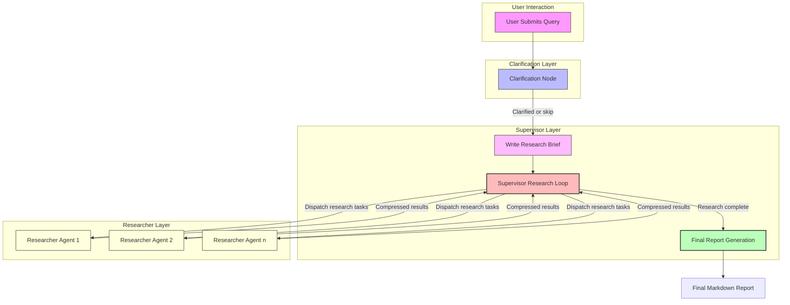

# Agent & Workflow Overview

Discover the macro-level design of the Deep Research agent, including its roles, layered orchestration, and state-based workflow for iterative research, clarification, and synthesis. Understand how supervisors and sub-agents collaborate and how the system integrates with various models and tools to produce high-quality, regulated research reports.

---

## Introduction

Open Deep Research employs a sophisticated agent orchestration architecture that enables automated deep research through iterative workflows. This overview presents the fundamental design of the Deep Research agent, highlighting key roles, layered coordination, and the state-driven research process.

The agent is composed of multiple collaborating units, primarily the research **Supervisor Agent** and one or more **Sub-agent Researchers**. Together, these components work through structured states and workflows that reflect user intent, progressively gather research knowledge, clarify ambiguities, and synthesize comprehensive reports.

---

## Agent Roles & Responsibilities

### Supervisor Agent

The Supervisor Agent acts as the central orchestrator of the research process:

- **Research Planning:** It receives the user's initial input or research brief and decomposes it into manageable sub-tasks or sections.
- **Coordination:** Dispatches research requests to multiple parallel Researcher Agents (sub-agents) for concurrent exploration.
- **Iteration & Reflection:** Collects synthesized results from sub-agents, assesses completeness, and decides whether further iterations or clarifications are needed.
- **Clarification:** Has the option to recognize when additional user clarification is needed before proceeding and can generate targeted questions.
- **Report Assembly:** Integrates completed sections, introduction, and conclusion to produce a final, cohesive research report.

### Researcher Agents (Sub-agents)

These agents specialize in investigating specific subsections or research topics:

- **Tool Calling:** Utilize configured tools such as web search APIs and MCP (Model Context Protocol) servers to gather information from supported data sources.
- **Asynchronous Workflow:** They operate asynchronously and in parallel, enabling rapid exploration across multiple topics.
- **Research Synthesis:** Each researcher compresses and synthesizes raw data into concise, quality summaries.
- **Completion Signals:** Explicitly indicate when their assigned research is complete.

The supervisor manages these agents within configured concurrency limits to optimize throughput and remain within API usage constraints.

---

## Layered Orchestration & State-Based Workflow

Open Deep Research leverages a **state graph-driven workflow architecture** that orchestrates interaction between the supervisor and researchers, managing the research lifecycle from input clarification to final report generation.

### Key Phases and States

1. **Clarification Phase**
   - The agent begins by assessing the initial query.
   - If the configuration permits, it may engage the user with clarifying questions to refine the research target.

2. **Research Brief Creation**
   - Transforms user input or clarified query into a structured research brief outlining specific topics or questions.

3. **Supervisor Research Phase**
   - The supervisor generates research tasks, making explicit calls to `ConductResearch` tools directing researcher sub-agents.
   - It reflects on results, updating messages and deciding whether to continue, clarify, or conclude.

4. **Parallel Research Sub-agency**
   - Multiple Researcher Agents each receive a research topic and execute asynchronous research cycles.
   - They call search APIs (e.g., Tavily, Perplexity, Exa) or MCP tools to fetch and analyze data.
   - Results are compressed and returned to the supervisor.

5. **Aggregation & Compression**
   - Synthesized research from sub-agents is gathered and combined.
   - The supervisor assesses completeness, possibly iterating further research or progressing to final assembly.

6. **Final Report Generation**
   - After research completion, the workflow triggers generation of introduction, conclusion, and cohesive markdown-formatted report using a dedicated model.

7. **Report Delivery**
   - The output is a structured, well-cited markdown document ready for presentation or further use.

---

## Collaborative Workflow Highlights

- **Iterative and Stateful**: The agent maintains message histories and state across phases, allowing reflection and refinement.
- **Parallelism with Concurrency Limits**: Sub-agent researchers operate in parallel for speed, controlled by configurable concurrency parameters.
- **Tool Integration**: Supports powerful tool calling capabilities including:
  - Web Search APIs: Tavily, Perplexity, Exa, ArXiv, PubMed, DuckDuckGo
  - MCP Servers: Local or remote servers exposing tools and data sources
- **Structured Outputs & Retry Logic**: Enforces models to produce structured outputs with retries on parsing failures to ensure dependable data.
- **Early Exit Conditions & Guardrails**: The supervisor monitors iterations and tool calls to avoid infinite loops and respects limits on research depth and tool call counts.

---

## Value-Driven User Flow Example

Imagine a user submits a broad research question: “What is the Model Context Protocol (MCP)?”

1. The agent decides whether the question is clear; if not, it asks a clarifying question to sharpen focus.
2. The supervisor then plans research sections (e.g., Architecture Overview, Ecosystem, Security) and dispatches parallel researchers.
3. Researchers invoke search and MCP tools concurrently to gather data.
4. The supervisor collects compressed summaries, refines understanding, and decides if further questions or data are necessary.
5. Once research completes, it triggers report assembly, generating a detailed, well-referenced markdown report.
6. The user receives a professional-quality research document without manual searching.

---

## Practical Configuration & Customization Points

- **Max Concurrent Research Units:** Controls parallel researchers to balance speed vs resource limits.
- **Max Research Iterations:** Limits the number of reflection cycles the supervisor performs.
- **Search API Selection:** Choose between supported web search providers or disable for MCP-only research.
- **MCP Server Integration:** Add local or remote MCP servers with secure prompts and tool selectors.
- **Model Provider & Selection:** Configure distinct models for planning, research, compression, and final report generation.
- **Clarification Enablement:** Toggle the initial user clarification step for tighter research targeting.

---

## Troubleshooting Common Challenges

- **Token Limits Exceeded:** The system prunes older message history automatically, but if persistent, lower max tokens or model size, or reduce concurrency.
- **No Tools Configured:** Ensure at least one search API or MCP tool is active; researchers require tools to conduct research.
- **Long-running Tasks:** Tweak concurrency and iteration limits to avoid bottlenecks.
- **Incomplete Reports:** Consider enabling clarification or increasing research iterations.

---

## Architecture Diagram

---

## Summary

- The Deep Research agent centrally uses a **supervisor-researcher multi-agent architecture** with clear role separation.
- The workflow is **iterative, stateful, and asynchronous**, enabling reflection, parallel research, and user-driven feedback.
- Researcher sub-agents access **search APIs and MCP servers** to gather high-quality, relevant data.
- The final report is generated by synthesizing sub-agent outputs into a coherent, markdown-formatted document.

---

## Next Steps & Related Documentation

- Explore **[State Graphs & Asynchronous Research Flows](../state-graphs-and-async-flows)** to understand the underlying orchestration engine.
- Review **[Agent State, Messages, and Research Data](../../data-and-models/agent-state-and-messages)** for details on state handling.
- For configuration tips and tool integration, see **[Integrating Search APIs and MCP Servers](../../integration-patterns/using-search-mcp-models)**.
- Learn how to **run evaluations** and improve report quality at **[Evaluating and Benchmarking Research Output](../../evaluation-and-best-practices/running-evaluations)**.
- Check legacy implementations for architecture alternatives at **[Legacy Implementations Guide](../../evaluation-and-best-practices/legacy-implementations-guide)**.

---

## Useful References

- [Open Deep Research GitHub Repository](https://github.com/langchain-ai/open_deep_research)
- MCP Specification: https://spec.modelcontextprotocol.io/
- MCP Servers & Tools: https://modelcontextprotocol.io/examples
- LangChain Chat Model Initialization: https://python.langchain.com/docs/how_to/chat_models_universal_init/

---

Take advantage of this comprehensive overview to grasp how Deep Research agents coordinate multi-layered workflows, handle complex user intents, and integrate multiple tools to automate expert-level research at scale.