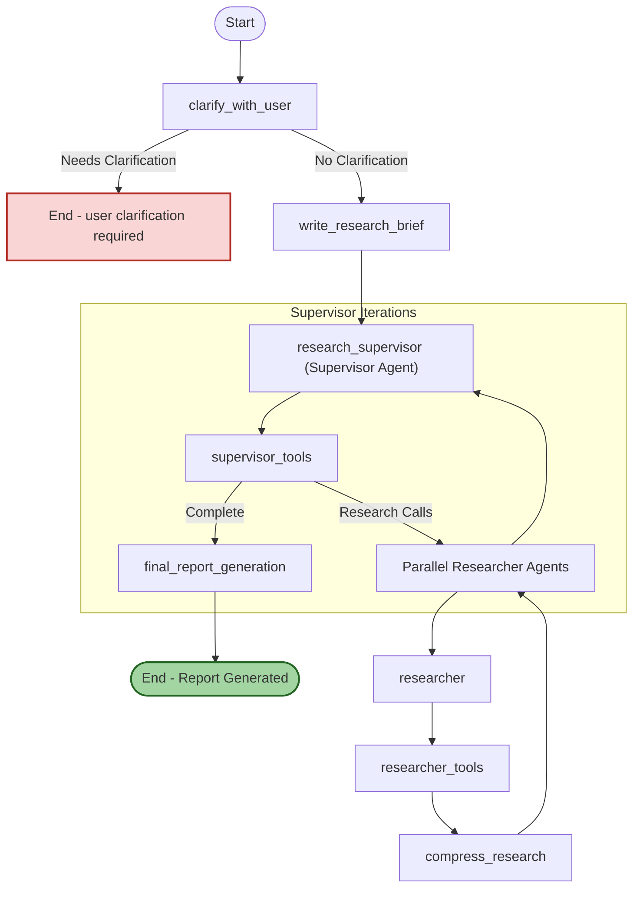

# State Graphs & Asynchronous Research Flows

Understand how Open Deep Research models research processes as state graphs and manages them asynchronously. This guide explains the sequence of clarifications, research cycles, tool executions, and synthesis phases. It also covers how agent states are persisted, aggregated, and transitioned to maintain a robust, scalable workflow.

---

## Introduction

In Open Deep Research, deep research and report generation are orchestrated as state-driven asynchronous workflows. These workflows are modeled using **state graphs** where each node corresponds to a discrete phase or operation in the research lifecycle.

State graphs encapsulate:

- User interactions such as clarifications
- Supervisor-driven planning and orchestration
- Parallel research execution by multiple sub-agents
- Tool invocations including search and MCP tools
- Research output compression and final report synthesis

This design enables modularity, fault tolerance, and the ability to handle long-running asynchronous tasks efficiently.

---

## Core Concepts of State Graphs

### What Is a State Graph?

A state graph defines a directed flow of states where each state:

- Represents an operation or computation step (e.g., clarifying input, researching a topic)
- Has well-defined transitions to other states upon completion
- Maintains and updates persistent state data through the process

Open Deep Research leverages the `langgraph` framework to declaratively build and execute these directed state graphs.

### Why Use State Graphs?

State graphs provide:

- **Explicit Workflow Control:** Each phase is distinctly modeled, enabling easier debugging and extension.
- **Asynchronous Execution:** States can perform long-running asynchronous tasks (like web search or querying MCP servers).
- **Parallelism:** Subgraphs and nested states support parallel researcher agents working simultaneously.
- **Recovered State:** Agent states are checkpointed and can resume after interruptions.
- **Structured Outputs:** Intermediate structured messages and tool calls can be managed precisely.

---

## Key States in the Research Workflow

Open Deep Research's core workflow progresses through these primary state types:

| State Name             | Purpose                                             |
|------------------------|-----------------------------------------------------|
| `clarify_with_user`    | Ask user clarifying questions to better understand research intent. |
| `write_research_brief` | Transform user input into a refined research question or brief. |
| `supervisor`           | Orchestrate research by distributing tasks to researchers and aggregating results. |
| `supervisor_tools`     | Execute supervisor-issued tool calls (e.g., initiate research agents).|
| `researcher`           | Generate research content by invoking search/MCP tools and analyzing data.|
| `researcher_tools`     | Run tool calls requested by researchers and gather results. |
| `compress_research`    | Compress and summarize gathered research notes into concise findings. |
| `final_report_generation` | Compose and synthesize the final report from aggregated notes. |

These nodes interact to produce an efficient, parallelized research and writing cycle.

---

## Detailed Workflow Sequence

### 1. Clarification Phase

- Triggered immediately after user input
- Clarifies ambiguous or broad research questions
- May ask follow-up questions before proceeding

### 2. Research Briefing

- Converts clarified input into a focused research brief
- Sets context for the supervisor and researcher agents

### 3. Supervisor Orchestration

- The supervisor agent plans research tasks
- Generates tool call instructions to instantiate parallel researcher agents
- Iterates through multiple reflection and research cycles, limited by configured max iterations

### 4. Parallel Research Execution

- Multiple researcher agents operate simultaneously, each focusing on assigned subtopics
- Researchers invoke configured search tools, MCP tools, or both
- Results are summarized and compressed asynchronously

### 5. Tool Execution

- Tool calls (e.g., web searches, MCP server queries) are executed safely
- Results are passed back to agents to update state
- Early and late exit criteria govern progression

### 6. Compression and Summarization

- Research notes and tool outputs are compressed to concise insights
- Supports up to 3 retries on token limit errors

### 7. Final Report Generation

- Aggregates all notes and research briefs
- Uses a structured prompt to generate a comprehensive markdown report
- Performs graceful retries if output exceeds token limits

---

## State Persistence and Updates

Open Deep Research uses **persistent state checkpointing** to reliably track agent states across asynchronous operations:

- The `MemorySaver` or other configured checkpointing stores state snapshots.
- State fields use append or override patterns to accumulate conversational messages, notes, and research data.
- Structured outputs (clarifications, research tools, summaries) update specific state objects.
- Transition commands (`Command`) define next states and state updates.

This ensures fault tolerance and allows resuming interrupted workflows seamlessly.

---

## Parallelism and Concurrency Controls

The framework supports concurrency with parameters to control scaling:

- `max_concurrent_research_units` caps simultaneous researchers.
- Tool call iterations (`max_react_tool_calls`) limit recursive tool invocations triggered by agents.
- Research iteration limits (`max_researcher_iterations`) govern how many times the supervisor reflects and retries research.

The supervisor dispatches multiple researchers in parallel, collects their results, and updates its state concurrently.

---

## Integration with Tools and MCP Servers

Researcher agents access:

- **Search APIs:** such as Tavily, DuckDuckGo, Perplexity
- **MCP Tools:** Custom or pre-built Model Context Protocol servers offering local or external data sources

Tool invocations are wrapped as **ToolCalls** inside AI messages and executed asynchronously. The workflow handles failures gracefully and provides meaningful error notices.

---

## Practical Tips and Best Practices

- **Configure token limits carefully:** To avoid truncation or API errors, especially in final report generation.
- **Limit concurrency to your API quotas:** Adjust `max_concurrent_research_units` according to your rate limits.
- **Use clarifications selectively:** Enable or disable clarifications to optimize user experience.
- **Monitor tool calls:** Excessive tool calling may indicate prompt inefficiencies.
- **Leverage persistence:** Use checkpointing for debugging and for long research tasks.

---

## Troubleshooting Common Issues

| Symptom                                | Likely Cause                       | Suggested Action                             |
|----------------------------------------|----------------------------------|----------------------------------------------|
| Timeout or stalled research             | Excessive concurrency or model delays | Reduce `max_concurrent_research_units` or check API latency |
| Token limit exceeded errors             | Overly long prompts or outputs    | Adjust max_tokens in model configs; prune history |
| No tools found during researcher phase  | MCP or search API not configured  | Verify `search_api` and MCP server settings  |
| Tool call execution errors              | API key missing or invalid        | Confirm environment variables; refresh keys |
| Incomplete final report generation      | Retries maxed out due to length   | Shorten input or increase model max_tokens  |

---

## Visualization: State Graph Flow

---

## Summary

Open Deep Research’s agent orchestration employs asynchronous state graphs that divide the research lifecycle into modular, fault-tolerant phases. The system supports clarification, supervisor-managed planning, parallel researcher execution, tool integration (including MCP servers), and final report synthesis — all tracked through persistent agent states. This architecture balances flexibility, concurrency, and robustness to deliver high-quality, well-structured research reports efficiently.

---

## References

- [langgraph Framework Documentation](https://langchain-ai.github.io/langgraph/)
- [Model Context Protocol (MCP) Specification](https://modelcontextprotocol.io/)
- Open Deep Research Implementation Source: [`src/open_deep_research/deep_researcher.py`](https://github.com/langchain-ai/open_deep_research/blob/main/src/open_deep_research/deep_researcher.py)
- Core Agent State Management: [`src/open_deep_research/state.py`](https://github.com/langchain-ai/open_deep_research/blob/main/src/open_deep_research/state.py)

---

## Next Steps

- Explore the [Deep Researcher Quickstart guide](../guides/core-workflows/researcher-quickstart) to see how state graphs power end-to-end research.
- Dive into [Configuring Models, Search, and MCP Servers](../guides/core-workflows/configuring-research-agents) for environment tuning.
- Review [Clarification, Reflection, and Iteration](../guides/core-workflows/clarification-and-iteration) for mastering the iterative workflow.
- Consult [Agent Overview & Architecture](../concepts/core-architecture/agent-overview) to understand agent roles and collaboration.

---

This page is part of the Conceptual Architecture section and augments knowledge of the async agent workflows critical to Open Deep Research's operation.