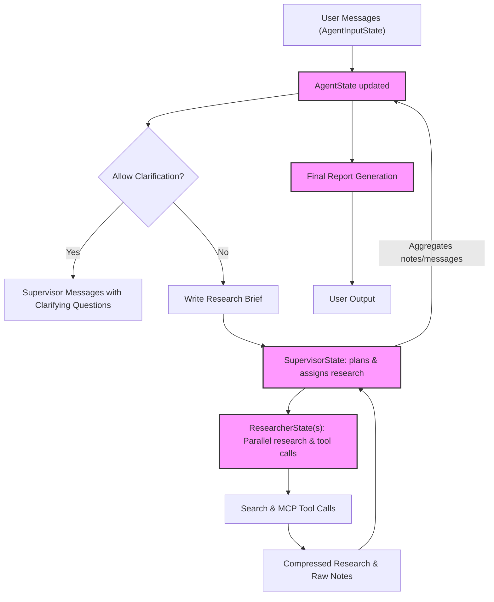

# Agent State, Messages, and Research Data

Explore how Open Deep Research models the internal states, chat messages, and research metadata throughout a research session. Understanding these concepts is essential for debugging, extending workflows, or integrating new behaviors seamlessly into the research process.

---

## Introduction

Open Deep Research manages complex asynchronous interactions between agents using structured state classes and message flows. This page focuses specifically on the representations and lifecycle of these states, the handling of chat messages, and how research data is aggregated and maintained. 

By grasping these concepts, developers and advanced users can effectively interpret agent workflows, customize the agent’s behavior, or debug unexpected outcomes.

---

## Key Concepts Overview

- **Agent States:** Represent the internal data snapshots of supervisor and researcher agents, encapsulating messages, notes, research briefs, and final reports.
- **Messages:** The primary communication unit exchanged by agents and models, including user, system, AI, and tool messages.
- **Research Data:** Includes research briefs, compressed notes, raw research data, and aggregated report content flowing through states.
- **State Aggregation Logic:** How new data from multiple tool calls and parallel research units merge into a coherent state.

---

## Agent State Classes and Their Roles

Open Deep Research implements several closely related state classes defined via Pydantic models and TypedDict for type safety and rigorous data handling.

### 1. `AgentState`

The top-level container for the entire research session's state, including:

- `supervisor_messages`: A growing list of all system, user, and AI messages processed by the supervisor agent, aggregated with a custom reducer that overrides or appends messages intelligently.
- `research_brief`: The distilled research question guiding the process.
- `raw_notes` and `notes`: Aggregated raw textual data and summarized notes collected during research.
- `final_report`: The culminating output report generated at session end.

### 2. `AgentInputState`

A minimal wrapper around incoming user messages initiating or continuing research workflows.

### 3. `SupervisorState`

Captures the supervisory agent’s internal status during iterations, including:

- Collected messages (`supervisor_messages`)
- Research brief
- Notes (both raw and processed)
- Number of completed iterations

### 4. `ResearcherState`

Holds the state specific to individual researcher agents working asynchronously:

- `researcher_messages`: Communicated messages used for query, research, and tool invocation
- `tool_call_iterations`: Count of how many tool call cycles have been executed
- `research_topic`: The assigned research subject
- `compressed_research`: The synthesized summary of research results
- `raw_notes`: Raw textual notes from tool outputs or model completions

### 5. `ResearcherOutputState`

Defines the output structure from a research agent, usually a compressed research summary with optional raw notes for debugging.

---

## Message Handling and Types

Messages are the core building blocks for interaction within Open Deep Research and follow strict roles and typing:

- **UserMessage:** Originates from user input or external triggers.
- **SystemMessage:** Instructions or prompts guiding the AI behavior.
- **AIMessage:** Responses generated by LLMs including tool calls.
- **ToolMessage:** Outputs from tools, including search or MCP calls.

Messages support tool calls which are requests embedded within AI messages instructing the agent to execute tools and return results before continuing the conversation.

The states keep track of all messages chronologically, enabling the agent to maintain conversation context and support iterative research and refinement.

---

## State Aggregation and Lifecycle

A notable aspect of the state management is the **aggregation logic** applied when updating state fields that contain lists of messages or notes. For example:

- The `supervisor_messages` and `raw_notes` fields use a custom reducer that can **override** values entirely or append new content, depending on the context of the update.
- This technique ensures that sequential and parallel updates from various asynchronous tasks merge predictably.

Lifecycle flow:

1. **Initialization:** User inputs initialize `AgentInputState` with messages.
2. **Clarification:** The agent may generate clarifying question messages.
3. **Research Brief Generation:** Messages are appended to `AgentState` capturing the refined research topic.
4. **Supervisor Iterations:** Supervisor state accumulates messages and notes from multiple researcher agents working in parallel.
5. **Research Agents:** Each ResearcherState independently collects messages, performs tool calls (search, MCP, etc.), and compresses research into summaries.
6. **Aggregation:** Supervisor aggregates researcher outputs, updating notes and messages.
7. **Final Report:** Compiled and stored in `final_report` in the AgentState at workflow completion.

---

## Practical Example: Research Lifecycle Breakdown

Imagine a user asks the agent: "What is Model Context Protocol?"

- The incoming message populates `AgentInputState`.
- After clarification, `AgentState` updates with an approved research brief capturing this question.
- The supervisor agent state logs messages as it plans research iterations.
- Multiple research agents spin off with distinct `ResearcherState` instances, each running parallel tool calls (e.g., web search, MCP server queries).
- Tool results feed back as `ToolMessage` entries populating the states.
- States aggregate summaries into `compressed_research`, which the supervisor uses to create and append notes.
- After sufficient iterations or completion signals, the supervisor transitions to final report generation.
- The `final_report` string is stored on the agent state and eventually returned to the user/output interface.

This flow, mediated by state classes and message exchanges, supports both completeness and parallel speedup.

---

## Tips & Best Practices

- **Manage message size:** To prevent token limits, the system prunes or aggregates messages thoughtfully during iteration.
- **Track iterations carefully:** `tool_call_iterations` and `research_iterations` counters prevent runaway loops.
- **Use overrides judiciously:** When replacing message lists, use the override aggregation to avoid inconsistent histories.
- **Include source strings conditionally:** Source content from search/MCP tools is added only if enabled for evaluation and debugging to conserve resources.
- **Comprehend role separations:** Supervisor states focus on coordination and aggregation; researcher states focus on topic-specific exploration and compression.

---

## Troubleshooting Common Issues

- **Unexpected final report missing:** Confirm that supervisor state contains `final_report` and supervisor iterations completed successfully.
- **Tool call results not recorded:** Verify correct tool call processing and updates to `raw_notes` and message lists.
- **Exceeding token limits:** Monitor message buffers and use model limits accordingly; consider pruning or lowering iteration counts.
- **State inconsistency in parallel agents:** Aggregation reducers must be correctly applied; concurrent updates need careful handling.

---

## Summary

Understanding how Open Deep Research agents manage their internal states, communicate through structured message objects, and aggregate research data through iterative cycles is fundamental to mastering the system. This layered approach enables scalable, parallel research workflows that produce accurate, well-structured reports with rich audit trails.

---

## Further Reading & References

- [Multi-Agent Implementation (src/legacy/multi_agent.py)](https://github.com/langchain-ai/open_deep_research/blob/main/src/legacy/multi_agent.py) — See state usage in multi-agent workflows
- [Agent State Definitions (src/open_deep_research/state.py)](https://github.com/langchain-ai/open_deep_research/blob/main/src/open_deep_research/state.py) — Modern state models and aggregation strategies
- [Deep Researcher Workflow (src/open_deep_research/deep_researcher.py)](https://github.com/langchain-ai/open_deep_research/blob/main/src/open_deep_research/deep_researcher.py) — How state and messages interact in the core workflow
- [Legacy Section State (src/legacy/state.py)](https://github.com/langchain-ai/open_deep_research/blob/main/src/legacy/state.py) — Legacy approach to section and report states
- [Concepts: Agent & Workflow Overview](https://langchain-ai.github.io/open_deep_research/concepts/core-architecture/agent-overview) — High-level agent and message flow

---

## Diagram: Simplified Agent State Flow

---