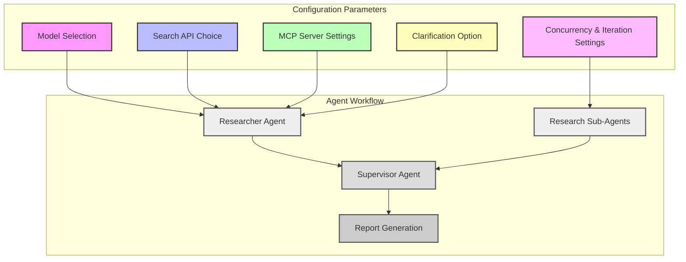

# Configuration Management & Model Selection

Open Deep Research offers a highly configurable environment enabling users to tailor the research process, models, tools, and concurrency settings to their specific needs. This flexibility supports diverse use cases, from quick fact-finding to in-depth analytical reports, ensuring optimal performance and output quality.

---

## Overview

This page explains how model configurations, search API selections, concurrency limits, and other key settings are managed within Open Deep Research. Understanding these configurations empowers users to customize the behavior of research agents and tools, align configurations with available resources, and optimize for speed, accuracy, or cost-efficiency.

The configurations covered here directly impact how research is conducted, how data is retrieved, and how ultimately reports are generated.

---

## Configuration Parameters Explained

Open Deep Research configurations are primarily managed through structured configuration classes that map to environment variables, UI settings, or direct runtime parameters. These configurations fall broadly into several categories:

### 1. Model Configuration

Models are central to the research process, each serving specific roles:

- **Research Model**: Conducts in-depth research, responsible for generating research questions, planning, and synthesizing findings. Must support tool calling and web search functions.
- **Summarization Model**: Summarizes raw search results and large bodies of research data, typically using fewer tokens or smaller models.
- **Compression Model**: Compresses detailed research notes into concise sections to optimize token use.
- **Final Report Model**: Produces the polished, final comprehensive report from compressed research and notes.

**Key Settings Include:**

- Model name (e.g., `openai:gpt-4.1`, `anthropic:claude-3-5-sonnet-latest`).
- Maximum tokens permitted in output to control cost and fit model limits.

*Example:*  
```yaml
research_model: openai:gpt-4.1
summarization_model: openai:gpt-4.1-nano
compression_model: openai:gpt-4.1-mini
final_report_model: openai:gpt-4.1
```

---

### 2. Search API Selection

Open Deep Research supports multiple web search APIs, enabling flexible data sourcing across general web search, academic databases, and biomedical literature.

**Available Search Providers:**

- Tavily (default general search)
- Perplexity
- Exa
- ArXiv (academic papers)
- PubMed (biomedical literature)
- Linkup
- DuckDuckGo
- Google Search
- None (disables search tools)

Each search API may support additional configuration parameters such as result limits or domain filtering.

**Configuration Example:**

```yaml
search_api: tavily
search_api_config:
  num_results: 5
  include_domains: ["nature.com", "sciencedirect.com"]
```

*Tip:* Choose search APIs compatible with your researcher model to avoid integration issues.

---

### 3. MCP (Model Context Protocol) Server Integration

Users can extend Open Deep Research capabilities with external MCP servers to access local file systems, databases, APIs, or specialized data sources.

**MCP Configuration Settings:**

- `mcp_config`: URLs, authentication, and tool lists for MCP servers
- `mcp_prompt`: Special instructions for the Researcher agent on how to use MCP tools
- `mcp_tools_to_include`: Whitelist of specific MCP tools to enable

*Use Case:* Restrict research agents to trusted document repositories or local knowledge bases.

---

### 4. Concurrency and Iteration Control

For optimal performance and resource management, Open Deep Research allows configuring how many research tasks and tool calls happen concurrently.

- `max_concurrent_research_units`: Number of parallel research units (sub-agents) to run simultaneously. Higher concurrency accelerates research but risks API rate limit issues.
- `max_researcher_iterations`: How many reflection cycles the research supervisor will perform, controlling depth of iterative research.
- `max_react_tool_calls`: Limits the number of tool-calling interactions during a single researcher step to prevent runaway use.

*Best Practice:* Balance concurrency to avoid exceeding third-party API quotas while maintaining responsiveness.

---

### 5. Clarification Settings

Users can enable or disable researcher clarification:

- `allow_clarification`: When enabled, the researcher may ask the user clarifying questions to better tailor the research.

---

## How Configuration Affects Agent Behavior and Research Outcomes

- **Model choice** impacts research style, response quality, and token limits. For example, using powerful models like GPT-4.1 improves coherence but increases costs.
- **Search API settings** determine the breadth, timeliness, and relevance of retrieved data.
- **Concurrency parameters** influence how quickly parallel research agents operate, impacting overall throughput and system load.
- **MCP integration** empowers agents with access beyond standard web search, enabling domain-specific or private context inclusion.
- **Clarification options** improve report tailoring but may extend interaction length.

Awareness of these dynamics enables users to tune configurations aligning with their priorities: speed, depth, relevance, or cost.

---

## Managing Configuration

Configurations are typically set through the following methods:

- **.env File or Environment Variables**: The `.env` configuration file includes key-value pairs for all configurable parameters, ideal for local or hosted deployments.
- **Open Agent Platform (OAP) UI**: Non-technical users can adjust key parameters via an intuitive web interface.
- **Direct Runtime Override**: Advanced users can supply configuration overrides at runtime using API calls or programmatic controls.

*Example .env snippet:*  
```
RESEARCH_MODEL=openai:gpt-4.1
SEARCH_API=tavily
MAX_CONCURRENT_RESEARCH_UNITS=5
ALLOW_CLARIFICATION=true
```

---

## Practical Tips and Best Practices

- **Select compatible models and search APIs** to avoid integration failures — reference your research model capabilities regarding native search or tool calling.
- **Start with conservative concurrency values** (around 5) and increase gradually while monitoring token usage and API rate limits.
- **Use MCP servers** to extend research into private or specialized contexts securely.
- **Enable clarification** if report accuracy and specificity are critical.
- **Use configuration defaults** for initial experimentation and fine-tune as you gain experience.

---

## Common Pitfalls and Troubleshooting

- **Misconfigured search API**: Selecting a search API not supported by the researcher model will cause failures or degraded performance.
- **Exceeding API rate limits**: Aggressive concurrency without monitoring can exhaust quotas, causing errors.
- **Too high max token settings**: Models may reject requests exceeding their maximum context window.
- **MCP misconfiguration**: Incomplete or incorrect MCP server details may lead to missing or failed tool calls.
- **Forgetting to enable structured output**: Some models require enabling structured output and retries to successfully parse tool responses.

When encountering issues, verify configuration values carefully, check logs for token or rate limit errors, and consult the [Configuration Setup](/getting-started/setup-basics/configuration-setup) and [Troubleshooting Guide](/getting-started/first-run-usage/quick-validation-and-troubleshooting).

---

## Advanced Configuration Example

Here is a sample configuration dictionary illustrating key parameters:

```python
config = {
    "configurable": {
        "research_model": "openai:gpt-4.1",
        "summarization_model": "openai:gpt-4.1-nano",
        "compression_model": "openai:gpt-4.1-mini",
        "final_report_model": "openai:gpt-4.1",
        "search_api": "tavily",
        "max_concurrent_research_units": 5,
        "max_researcher_iterations": 3,
        "max_react_tool_calls": 5,
        "allow_clarification": True,
        "mcp_config": {
            "url": "https://mcp.example.com",
            "tools": ["list_files", "read_file"],
            "auth_required": True
        },
        "mcp_prompt": "Use the MCP tools carefully for file system access.",
        "mcp_tools_to_include": ["list_files", "read_file"]
    }
}
```

---

## Visualization: Configuration & Agent Interaction



---

## Related Documentation

- [Configuration Setup](/getting-started/setup-basics/configuration-setup): Step-by-step guide to editing the .env and runtime configs.
- [Configuring Research Agents](/guides/core-workflows/configuring-research-agents): Detailed coverage of setting models, search, concurrency.
- [Integrating Search APIs and MCP Servers](/guides/integration-patterns/using-search-mcp-models): Best practices for advanced data source integration.
- [Agent & Workflow Overview](/concepts/core-architecture/agent-overview): Understand the agent roles influenced by configuration.
- [Quick Validation & Troubleshooting](/getting-started/first-run-usage/quick-validation-and-troubleshooting): Common issues with model and tool configuration.

---

## Next Steps

- Experiment by adjusting `max_concurrent_research_units` and `max_researcher_iterations` to find the ideal balance of speed and thoroughness.
- Integrate MCP servers to leverage proprietary data sources beyond web search for richer reports.
- Select specialized models for summarization and final report generation to optimize cost and coherence.
- Consult the [Deep Researcher: From Question to Report](/guides/core-workflows/researcher-quickstart) to see configuration impact on the research lifecycle.


<Tip>
Always verify that your chosen models support the required features such as tool calling and structured output to ensure smooth operation.
</Tip>

<Warning>
Incorrect or incompatible search API selections can cause the researcher agent to fail research queries. Confirm compatibility before switching providers.
</Warning>