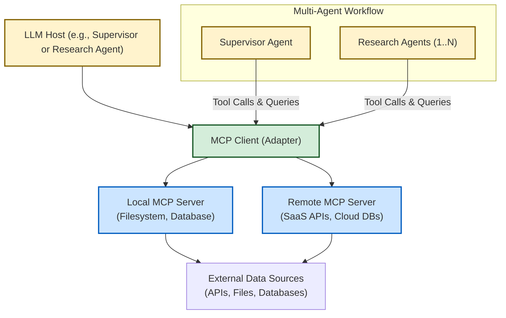

# Integration Patterns: MCP Servers & Tools

Explore how Open Deep Research integrates external systems securely and efficiently using Model Context Protocol (MCP) servers and tools. This page guides you through the diverse integration patterns available—both local and remote—and covers essential authentication methods, dynamic tool registration, and best practices to enhance your research agents' capabilities.

---

## Introduction

Effective integration with external data sources, APIs, and tools is vital for building powerful, context-aware research agents. Open Deep Research achieves this through Model Context Protocol (MCP), an open, client-server standard designed to allow large language model (LLM) applications to securely interact with external capabilities.

This document explains integration patterns focused on utilizing MCP servers and tools, authentication approaches including JWT and OAuth, and strategies to safely add new tools or servers without compromising security or maintainability.

---

## Understanding MCP Integration Patterns

MCP enables a flexible approach to extend research agents’ access beyond simple web searches, opening local filesystems, databases, SaaS APIs, and custom services. These integration patterns fall into two main categories:

### 1. Local MCP Server Integration

Local MCP servers run as lightweight processes on the same machine or trusted network. They provide controlled, secure access to local resources such as file directories or internal databases.

- **Use Case**: Accessing project documentation, code repositories, or proprietary data sources.
- **Example**: The Filesystem MCP server exposes directory listings and file read capabilities through JSON-RPC over standard IO (stdio).
- **Security**: Access is restricted to explicitly allowed directories or databases, enforcing file path whitelisting and sandboxing.

#### Example Filesystem MCP Server Configuration
```python
config = {
    "configurable": {
        "search_api": "none",  # Disable web search for this config
        "mcp_server_config": {
            "filesystem": {
                "command": "npx",
                "args": [
                    "-y",
                    "@modelcontextprotocol/server-filesystem",
                    "/path/to/allowed/directory"
                ],
                "transport": "stdio"
            }
        },
        "mcp_prompt": "Step 1: Use list_allowed_directories. Step 2: Use list_directory. Step 3: Use read_file. Follow this order strictly.",
        "mcp_tools_to_include": ["list_allowed_directories", "list_directory", "read_file"]
    }
}
```

In this setup, the research agents will use MCP tools to list directories and read files safely, enriching research with local context.

### 2. Remote MCP Server Integration

Remote MCP servers run independently and serve multiple clients. They enable distributed agent coordination and integration with cloud APIs or enterprise resources.

- **Use Case**: Connecting to SaaS applications (Slack, GitHub), cloud-hosted databases, or organization-wide CRM systems.
- **Authentication**: JWT tokens acquired via OAuth flows secure communication.
- **Transport**: HTTP + Server-Sent Events (SSE) or WebSocket pipelines facilitate bi-directional message streaming.

#### Sample Remote MCP Server Configuration
```json
{
  "url": "https://api.arcade.dev/v1/mcps/ms_0ujssxh0cECutqzMgbtXSGnjorm",
  "tools": ["Search_SearchHotels", "Search_SearchOneWayFlights", "Search_SearchRoundtripFlights"]
}
```

Remote servers integrate with enterprise security policies and can require multi-factor authentication or fine-grained access control.

---

## Authentication and Security in MCP Integration

Robust authentication ensures that only authorized agents can access sensitive data through MCP servers.

### Common Authentication Patterns

- **JWT (JSON Web Token)**: Used for bearer token authentication, often with expiration and scopes detailing allowed operations.
- **OAuth 2.0 / OpenID Connect (OIDC)**: Flow for acquiring JWT tokens with user consent and delegated authority.
- **API Gateway**: Centralized entry points that enforce rate limits, auditing, and token validation.

### Best Practices

- Enforce **Least Privilege** by scoping tokens narrowly to allowed MCP capabilities.
- Use **TLS 1.2/1.3** for encrypted transport channels.
- Validate **Origin Headers** and restrict access to localhost for local MCP servers.
- Implement **Sandboxing** when executing code or actions triggered by tools.
- Maintain **Audit Logs** for all tool calls and data access.

---

## Tool Registration and Dynamic Discovery

MCP servers expose their capabilities via JSON-RPC descriptions of tools, prompts, and resources.

- Upon initializing a session, the client receives the tool list from the server.
- The client then can invoke tools by name, provide input arguments as JSON, and receive structured results.
- This enables **dynamic tool discovery**: new servers or tools can be added without modifying client code.

### Safely Adding New Tools or Servers

To maintain security and stability:

- Register only vetted MCP servers in configuration.
- Use **whitelisting** for tool names or capabilities through configuration (`mcp_tools_to_include`).
- Isolate experimental or untrusted servers.
- Monitor and log tool usage patterns for anomalies.

---

## How Multi-Agent Implementation Leverages MCP

The multi-agent research implementation (`src/legacy/multi_agent.py`) uses MCP servers to supply research agents with advanced toolsets beyond traditional web search.

- Research agents dynamically load MCP tools via `MultiServerMCPClient` when configured.
- MCP tools integrate seamlessly alongside search engines to expand the agent's knowledge.
- Tools are called through JSON-RPC formatted messages within each agent’s reasoning cycle.
- The system respects configuration flags allowing easy enablement or disabling of MCP tool usage.

This integration pattern empowers agents to perform complex queries locally or access enterprise data securely, shortening research iteration cycles and enriching answers.

---

## Troubleshooting Common Integration Issues

- **No MCP Tools Found**: Confirm `mcp_server_config` is properly set in your configuration. If empty, no MCP tools will load.
- **Tool Name Conflicts**: Use `mcp_tools_to_include` to avoid naming collisions and exclude unwanted tools.
- **Authentication Failures**: Check JWT token validity, scopes, and endpoint URLs.
- **Transport Issues**: Ensure stdio or SSE/WebSocket transports are operational and network policies allow connections.
- **Permission Denied Errors**: Verify directory whitelisting or API authorization permissions.

---

## Practical Tips and Next Steps

- **Begin with Local MCP Servers** such as the Filesystem server to safely explore integration.
- **Combine MCP and Web Search** by configuring `search_api` alongside MCP tools.
- **Add Custom MCP Servers** by following SDK guides and security best practices.
- **Monitor Performance** and carefully manage concurrency parameters in configuration for stability.
- **Consult Security Model & Permissions documentation** to deepen your understanding of safe MCP deployments.

---

## Diagram: MCP Integration in Multi-Agent Workflow

