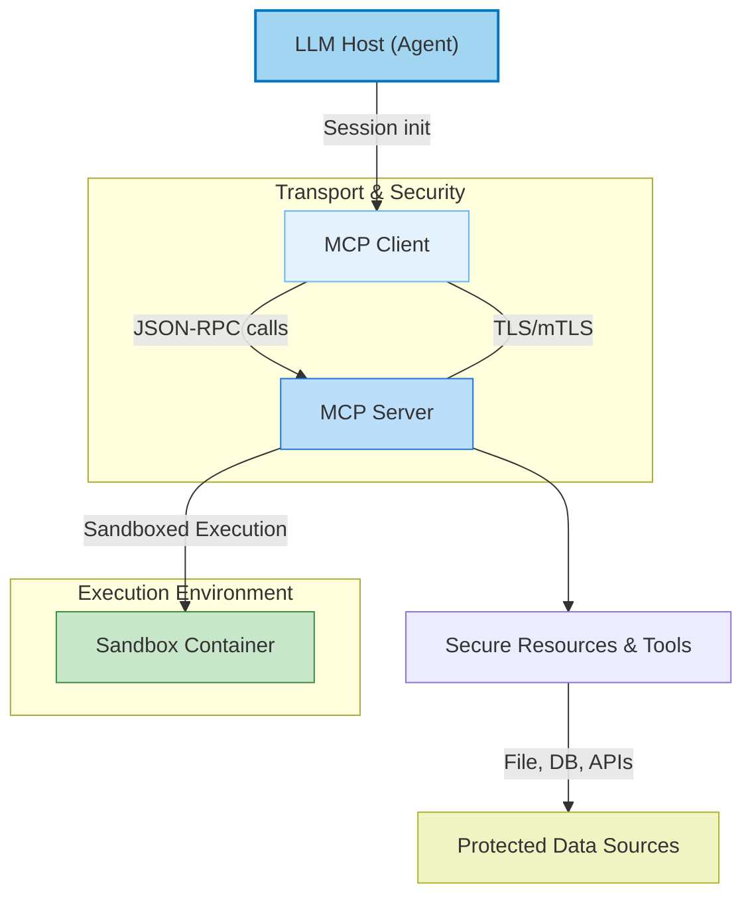

# Security Model & Permissions

Understanding the security model and permissions framework in Open Deep Research is essential to safeguard user data, ensure safe operations, and securely integrate with external systems, especially when using Model Context Protocol (MCP) servers or custom tools. This guide provides a focused overview of the architecture's safeguards that govern access, execution, and communication, helping users maintain trust and reliability throughout their research workflows.

---

## 1. Core Security Principles

The security design rests on several foundational principles:

- **Least Privilege:** Components and agents operate with only the minimum permissions required.
- **Explicit Authentication:** Every external interaction requires verified credentials.
- **Granular Authorization:** Access rights are detailed and scoped, governing who can do what.
- **Safe Execution Environments:** Code and tool calls are sandboxed to prevent unauthorized impacts.
- **Data Residency & Privacy:** User data is segmented, encrypted, and controlled to meet compliance.

---

## 2. File System Controls and Directory Restrictions

When using local or MCP-based filesystem servers, Open Deep Research enforces strict controls to confine file operations within explicitly allowed directories. 

### How this works:

- **Allowed Directories Discovery:** The agent must first query the `list_allowed_directories` tool to obtain the directories it may access.
- **Sequential Access Enforcement:** Only after obtaining the allowed directories can the agent call `list_directory` or `read_file` on those paths.
- **Restricted Access Scope:** Attempts to access files or directories outside this set are blocked, ensuring sensitive or unrelated data remains protected.

### Practical Example: Filesystem MCP Server Configuration

```json
{
  "filesystem": {
    "command": "npx",
    "args": [
      "-y",
      "@modelcontextprotocol/server-filesystem",
      "/path/to/allowed/dir1",
      "/path/to/allowed/dir2"
    ],
    "transport": "stdio"
  }
}
```

To complement this, you provide an MCP prompt enforcing the correct usage sequence:

```plaintext
CRITICAL: You MUST follow this EXACT sequence when using filesystem tools:

1. FIRST: Call `list_allowed_directories` to discover allowed directories
2. SECOND: Call `list_directory` on one of the allowed directories
3. THIRD: Call `read_file` on files found in the directory

DO NOT call `list_directory` or `read_file` before `list_allowed_directories`.
```

---

## 3. Authentication for Remote MCP Servers

Remote MCP servers often serve multiple clients and require robust authentication measures to protect data integrity and prevent unauthorized access.

### Authentication Methods Supported:

- **OAuth 2.0 / OpenID Connect (OIDC):** Typical production deployments require clients to obtain short-lived JWT tokens from a trusted Authentication Provider.
- **API Keys:** Some MCP services may use token-based keys for authentication.
- **Session Tokens:** Managed by MCP clients for continuity.

### Enforcement Practices:

- **Token Validation:** MCP Servers validate incoming bearer tokens against their authorization scopes before processing requests.
- **Scope-Based Authorization:** Tokens are mapped to specific RBAC or ABAC scopes like `mcp.chat.read` or `mcp.tool.exec`.
- **Rate Limiting:** Applied per token to protect against DoS attacks and misuse.

---

## 4. Execution Sandboxing and Tool Calling Safeguards

Given that MCP allows LLM agents to invoke external tools, strict safeguards ensure these calls don’t jeopardize system security.

- **Sandboxed Containers:** LLM-generated code or tool execution runs in isolated Docker or gVisor containers with CPU, memory, and file system quotas.
- **Read-Only File Systems:** File access is restricted to read-only mounts unless explicitly authorized.
- **No Network Egress:** Containers typically prevent unauthorized network access unless explicitly enabled.
- **Automatic Rollback:** If a tool call or code execution fails, sandbox environments reset to a clean state.
- **Tool Whitelisting:** Only configured and vetted tools are executable by agents.

---

## 5. Data Protection in Transit and at Rest

- **Transport Layer Security:** All communication between agents, MCP clients, and servers uses TLS 1.2 or 1.3.
- **Mutual TLS (mTLS):** Enforced where applicable, particularly for internal microservice connections.
- **Encryption at Rest:** Data such as vectors, prompts, logs, and notes are encrypted (AES-256) in local or cloud storage.
- **Data Residency Controls:** User data is stored and replicated only within permitted geographic and compliance boundaries.

---

## 6. User Consent and Interactive Safety

- **Confirmations for Sensitive Actions:** Tools that can modify or expose sensitive data require explicit confirmation or user consent.
- **Prompt Filtering:** Content sent to or received from external tools goes through safety and content filters to prevent injection attacks.
- **Audit Logging:** All tool calls and external interactions are logged for monitoring and forensic capabilities.

---

## 7. Common Pitfalls and Tips for Secure Operation

- **Always Set MCP Roots:** Ensure MCP filesystem servers are configured with explicit allowed roots to prevent accidental data leakage.
- **Use OAuth/JWT for Remote Servers:** Do not run unauthenticated or open MCP servers in production.
- **Limit Tool Scope:** Only expose tools your agents actually require; avoid unnecessary broad access.
- **Monitor Token Usage:** Track API and token usage to catch unusual patterns early.
- **Test Sandbox Constraints:** Run test scenarios to verify sandbox restrictions work as expected.

---

## 8. Troubleshooting Common Security Issues

<AccordionGroup title="Troubleshooting Security Issues">
<Accordion title="Access Denied Errors When Using File Tools">
Ensure you have first called `list_allowed_directories` and are only accessing paths within the returned list. Check MCP server logs for permission denials.
</Accordion>
<Accordion title="Authentication Failures with Remote MCP Server">
Verify that the provided JWT token is valid, unexpired, and contains correct scopes. Also confirm token issuer and audience match the MCP server’s expectations.
</Accordion>
<Accordion title="Sandboxed Tool Calls Failing Unexpectedly">
Check the container resource limits and file system mounts. Look for error logs that show permission or resource exhaustion issues.
</Accordion>
<Accordion title="Data Not Persisting Across Sessions">
Ensure that storage backends are correctly configured with encryption keys and appropriate access rights.
</Accordion>
</AccordionGroup>

---

## 9. Visual Overview of Security Layers



---

## 10. References and Resources

- [Model Context Protocol Official Specification](https://spec.modelcontextprotocol.io/specification/2025-03-26/architecture/)
- [Microsoft Security Guidance for LLM Applications](https://learn.microsoft.com/en-us/ai/playbook/technology-guidance/generative-ai/mlops-in-openai/security/security-plan-llm-application)
- [Anthropic MCP Server Repository](https://github.com/madhukarkumar/anthropic-mcp-servers)
- [Open Deep Research Configuration Setup](../../getting-started/setup-basics/configuration-setup)
- [Integration Patterns: Using Search APIs and MCP Servers](../../guides/integration-patterns/using-search-mcp-models)

---

This security framework ensures Open Deep Research users can confidently extend agent capabilities with safe, authorized tools and external data sources while retaining strict control over data and execution boundaries.