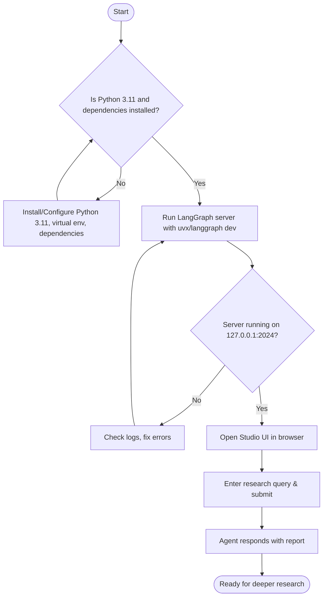

# Launching the Agent

This guide provides detailed, step-by-step instructions for starting the Open Deep Research agent locally. You will learn how to run the LangGraph server, access the Studio web UI, use the command-line options available during startup, and verify that your environment is ready to interact with the agent.

---

## 1. Prerequisites & Preparation

Before launching the agent, ensure your environment meets the following prerequisites:

- **Python 3.11** installed and accessible in your terminal
- A virtual environment activated to isolate dependencies
- Open Deep Research repository cloned and dependencies installed (see [Installation](https://github.com/langchain-ai/open_deep_research/blob/main/getting-started/setup-basics/installation.mdx))
- API keys (e.g., for OpenAI, Anthropic, Tavily search) configured in your environment or `.env` file

<Tip>
If you have not set up the repository or environment yet, refer to the prerequisites and installation guides before proceeding.
</Tip>

## 2. Running the LangGraph Server Locally

The LangGraph server is the core runtime environment that powers the Open Deep Research agent. Starting it locally allows you to access the full Studio UI for conversational and operational control.

### Starting the Server

Open your terminal and run the following command from the repository root:

```bash
uvx --refresh --from "langgraph-cli[inmem]" --with-editable . --python 3.11 langgraph dev --allow-blocking
```

This command:

- Refreshes the uv package manager cache
- Installs and activates the LangGraph CLI with in-memory storage
- Runs the LangGraph server in development mode (`langgraph dev`)
- Enables the server to handle synchronous code execution (`--allow-blocking`)

### Key Command-Line Options

- `--refresh`: Ensures latest package metadata is fetched
- `--from "langgraph-cli[inmem]"`: Installs LangGraph with in-memory backend suitable for testing
- `--with-editable .`: Installs the current directory as editable, allowing live code changes
- `--python 3.11`: Specifies Python version 3.11, recommended for compatibility
- `langgraph dev`: Launches LangGraph server in development mode
- `--allow-blocking`: Permits blocking calls within the async server

<Tip>
On Windows or Linux, if you prefer, you can also run the server by first installing dependencies manually:

```powershell
pip install -e .
pip install -U "langgraph-cli[inmem]"
langgraph dev
```

</Tip>

## 3. Accessing the Studio Web UI

Once the server is running, you can open the LangGraph Studio web interface in your browser:

- **API Base URL:** `http://127.0.0.1:2024`
- **Studio UI:** [https://smith.langchain.com/studio/?baseUrl=http://127.0.0.1:2024](https://smith.langchain.com/studio/?baseUrl=http://127.0.0.1:2024)
- **API Docs:** `http://127.0.0.1:2024/docs`

The Studio UI provides:

- A `messages` input box where you can type your research queries
- Interactive controls to submit questions and receive generated reports
- Visualization of ongoing processes

<Tip>
Bookmark the Studio UI URL for easy access during your research sessions.
</Tip>

## 4. Understanding Startup Output

When the server starts, it displays logs that confirm the following:

- LangGraph server is running and listening on the expected port (default: 2024)
- All required dependencies and plugins are loaded
- Your Python environment and virtual environment are active
- Any warnings or notices related to package versions or API keys

<Info>
If you see messages about missing API keys, make sure to set environment variables like `OPENAI_API_KEY`, `ANTHROPIC_API_KEY`, etc., before starting the server.
</Info>

## 5. Verifying the Agent is Ready

To confirm the agent is ready:

1. Visit the Studio UI URL in your browser
2. Enter a sample research query (e.g., "What is Model Context Protocol?") into the `messages` field
3. Press `Submit` to send the request
4. Observe the agent’s response and report generation progress

If you receive a well-formed response with meaningful content, your environment is correctly set up.

<Tip>
If the response is empty, slow, or errors occur, check logs for errors and verify your API keys and environment setup.
</Tip>

## 6. Common Startup Troubleshooting

<AccordionGroup title="Troubleshooting Launch Issues">
<Accordion title="LangGraph server does not start or crashes immediately">
- Ensure Python 3.11 is installed and active.
- Confirm a virtual environment is activated.
- Verify that `uvx` or equivalent package manager is installed.
- Check for conflicting processes on port 2024.
- Review full error messages for missing dependencies.
</Accordion>
<Accordion title="API key warnings or missing keys">
- Check that all required environment variables are set:
  - `OPENAI_API_KEY`
  - `ANTHROPIC_API_KEY`
  - `TAVILY_API_KEY`
- Use `.env` file or export in shell.
- Do not embed keys directly in code.
</Accordion>
<Accordion title="Studio UI doesn’t load in browser">
- Confirm server is running and accessible at `http://127.0.0.1:2024`.
- Check for firewall or network restrictions blocking localhost.
- Make sure the baseUrl query parameter is correctly encoded.
- Retry clearing browser cache.
</Accordion>
</AccordionGroup>

## 7. Next Steps

Now that the agent is running and you can access the Studio UI, proceed to your first research inquiry:

- Go to [Your First Research Query](../your-first-research-query) to learn how to formulate questions
- Review [Quick Validation & Troubleshooting](../quick-validation-and-troubleshooting) for additional support
- Customize configuration parameters for search API, models, and MCP integrations via the `.env` file or Studio UI / API

---

## Summary

Running the Open Deep Research agent locally involves launching the LangGraph server using `uvx` or pip-installed CLI tools, then accessing the interactive Studio UI to submit and receive research reports. Proper environment setup, especially installing Python 3.11, setting API keys, and managing dependencies, ensures a smooth startup. The guide covers interpreting startup logs, command-line options, and troubleshooting common issues to verify readiness.

---

## Visual Overview of Launch Flow



---