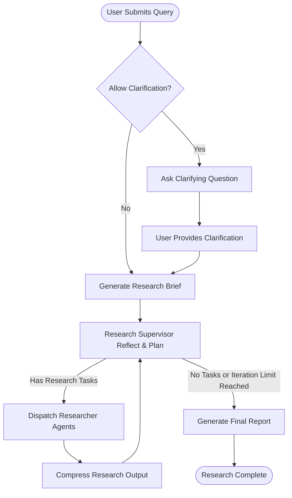

# Clarification, Reflection, and Advanced Iterations

Master the research process by leveraging clarifying questions, iterative improvement, and research supervisor settings. This guide details how Open Deep Research reflects on information, asks follow-up questions, and maximizes answer accuracy through structured iteration and supervision.

---

## 1. Understanding the Clarification and Reflection Cycle

Before generating extensive research content, Open Deep Research focuses on clarifying the research intent and iteratively refining findings. This step ensures the output is precisely aligned with your goals.

### Purpose
- Confirm your research intent through clarifying questions.
- Prevent wasted effort on irrelevant or insufficiently scoped topics.
- Enable iterative improvement through supervisor reflection.

### Workflow Highlights
- **Clarify With User:** The system may ask you targeted questions if the initial input lacks clarity.
- **Research Supervisor:** An orchestrator agent reflects on intermediate results and decides on next steps.
- **Research Iterations:** Multiple reflection and research rounds improve depth and coverage.


## 2. Prerequisites

Before using these iterative functions, ensure:
- You have a properly configured environment including model selections and API keys.
- `allow_clarification` flag is enabled in configuration to allow clarifying questions.
- Your environment supports asynchronous agent workflows.


## 3. Step-by-Step Guide to Clarification and Iterative Research

<Steps>
<Step title="Submit Initial Research Query">
Begin by inputting a clear question or research topic in the Studio UI or via API.

Expected Result: The system either proceeds or asks clarifying questions.
</Step>
<Step title="Respond to Clarifying Questions">
If prompted, answer specific follow-up questions about scope, depth, audience, or content focus.

Expected Result: System verifies your input and frames a precise research brief.
</Step>
<Step title="Research Brief Generation">
The system uses your clarified input to generate a detailed research brief guiding the investigation.

Expected Result: A concise, actionable research question is created for downstream research agents.
</Step>
<Step title="Supervisor-Led Research and Reflection">
The Supervisor agent orchestrates multiple research iterations, reflecting on gathered data and refining queries or requests.

 - It uses configured models to review findings.
 - Limits concurrency and iteration counts based on settings.

Expected Result: Progressive enrichment and compression of research insights.
</Step>
<Step title="Termination or Escalation">
The process continues until one of these conditions is met:
 
 - Maximum research iterations reached.
 - No new tool calls or questions generated.
 - Research complete indicated by tooling.

Expected Result: Final research insights are synthesized and passed downstream.
</Step>
<Step title="Final Report Generation">
Once research is complete, the system compiles findings into a cohesive, fully structured markdown report.

Expected Result: High-quality report with introduction, comprehensive body sections, and conclusion.
</Step>
</Steps>


## 4. Configuration Options Affecting Clarification and Iteration

- **allow_clarification** (`bool`, default: `true`): Enables the supervisor to ask clarifying questions before research starts.
- **max_researcher_iterations** (`int`, default: 3): Controls how many reflection cycles the supervisor performs.
- **max_structured_output_retries** (`int`, default: 3): Number of retries when models fail to produce well-formed structured outputs.
- **max_concurrent_research_units** (`int`, default: 5): Limits parallel research tasks to balance speed and resource usage.

These settings can be adjusted via `.env`, Studio UI, or programmatically using the configuration schema.


## 5. Best Practices for Effective Clarification and Reflection

- Provide as detailed initial input as possible to minimize unnecessary clarification cycles.
- Use the clarifying questions as an opportunity to precisely shape report focus, audience, and depth.
- Monitor iteration limits to avoid excessive resource consumption.
- Review intermediate supervisor messages in Studio UI for unexpected behaviors.
- Use `max_concurrent_research_units` wisely; increasing concurrency speeds up research but risks rate limits.


## 6. Practical Example: Research Workflow with Clarification

```python
import asyncio
from open_deep_research.deep_researcher import deep_researcher_builder
from langgraph.checkpoint.memory import MemorySaver
import uuid

async def run_research():
    graph = deep_researcher_builder.compile(checkpointer=MemorySaver())
    config = {
        "configurable": {
            "thread_id": str(uuid.uuid4()),
            "allow_clarification": True,
            "max_researcher_iterations": 3,
            "max_structured_output_retries": 3,
            "search_api": "tavily",
            "max_concurrent_research_units": 5,
            "summarization_model": "openai:gpt-4.1-nano",
            "summarization_model_max_tokens": 8192,
            "research_model": "openai:gpt-4.1",
            "research_model_max_tokens": 10000,
            "compression_model": "openai:gpt-4.1-mini",
            "compression_model_max_tokens": 10000,
            "final_report_model": "openai:gpt-4.1",
            "final_report_model_max_tokens": 10000,
        }
    }
    inputs = {
        "messages": [{"role": "user", "content": "Explain how Model Context Protocol enhances LLM integrations."}]
    }
    result = await graph.ainvoke(inputs, config)
    print(result.get("final_report"))

if __name__ == "__main__":
    asyncio.run(run_research())
```


## 7. Troubleshooting Common Issues

<AccordionGroup title="Troubleshooting Clarification and Iteration">
<Accordion title="No Clarifying Questions Asked When Expected">
- Verify `allow_clarification` is enabled.
- Ensure input prompt is ambiguous enough to warrant clarification.
- Check logs for model errors or silent failures.
</Accordion>
<Accordion title="Research Iterations Exceed Limits Too Early or Too Late">
- Confirm `max_researcher_iterations` is set correctly.
- Monitor supervisor messages for premature exit signals.
- Inspect token limits and model errors that might cause early termination.
</Accordion>
<Accordion title="Final Report Lacks Integration of All Sections">
- Check if all sections have completed research cycles.
- Ensure no errors occur in compression or summarization steps.
- If using custom prompts, verify they do not cause omission.
</Accordion>
<Accordion title="Token Limit Errors During Reflection or Synthesis">
- Increase model token limits if possible.
- Reduce input message history or call fewer concurrent research units.
- Use retry logic present in the system which prunes messages automatically.
</Accordion>
<Accordion title="Tools Not Invoked During Research">
- Verify search API and MCP tool configurations.
- Confirm tool calling is supported by chosen models.
- Check for errors or warnings during asynchronous tool execution.
</Accordion>
</AccordionGroup>


## 8. Advanced Tips and Insights

- Use the iterative reflection to verify and enrich research breadth systematically.
- Combination of clarifying questions and supervisor-driven iteration yields high accuracy.
- Structured retries safeguard against model hallucinations and parsing errors.
- Utilize logs and intermediate states to debug unclear research outcomes.
- Balance concurrency settings against API rate limits and computational costs.


## 9. What Happens Under the Hood?

At the core, the system works as follows:

1. **Clarification Node:** Checks if clarification is needed, asking the user questions to refine input.
2. **Research Supervisor:** Runs iterative loops, reflecting on research results, deciding next research units, and mixing queries.
3. **Researcher Agents:** Conduct parallel research tasks, execute searches, and call tools.
4. **Compression and Summarization:** Compress research output progressively.
5. **Final Report Node:** Synthesizes all findings into a polished report with structured sections.

This process harnesses model retries, tool calling, and concurrency controls to ensure quality and performance.


## 10. Related Documentation and Next Steps

- [Deep Researcher Quickstart](../researcher-quickstart): Learn the complete end-to-end research workflow from question to report.
- [Configuring Research Agents](../configuring-research-agents): Customize models, search APIs, MCP tool integration, and concurrency.
- [Integrating Search APIs and MCP Servers](../../integration-patterns/using-search-mcp-models): Expand research data sources.
- [Performance, Reliability, and Troubleshooting](../../evaluation-and-best-practices/performance-and-reliability-tips): Diagnose and optimize workflows.
- [Legacy Implementations](../../evaluation-and-best-practices/legacy-implementations-guide): Explore alternate multi-agent and graph-based research architectures.

For full reference, see the [Open Deep Research GitHub Repository](https://github.com/langchain-ai/open_deep_research).

---

## Diagram: Clarification and Iterative Research Flow



---