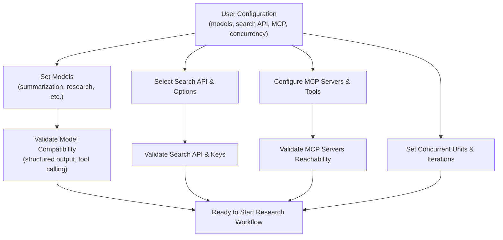

# Configuring Models, Search, and Research Parameters

Customize your Open Deep Research agent to fit your research needs by adjusting models, search tools, concurrency limits, iteration controls, and structured output expectations. This guide provides clear, actionable instructions for configuring these critical parameters through environment variables, `.env` files, or the Studio UI.

---

## 1. Overview of Configuration

The "Configuring Models, Search, and Research Parameters" page empowers you to tailor each stage of the research lifecycle to your goals and resources. It focuses explicitly on:

- Selecting model providers and specific model versions
- Integrating and configuring search engines for data retrieval
- Setting concurrency and iteration controls to balance speed and cost
- Specifying output formatting and tool calling behavior
- Applying prompts that enhance MCP (Model Context Protocol) based tool usage

You won’t find generic installation or deployment instructions here, but rather focused advice on how configuration impacts research workflows and outcomes.

### Prerequisites

- You have installed Open Deep Research and launched the LangGraph server or Open Agent Platform UI.
- Your environment contains required API keys (e.g., OpenAI, Anthropic, Tavily) set as environment variables or in `.env`.
- Familiarity with Open Deep Research’s multi-agent and graph-based research implementations is helpful but not mandatory.

### Expected Outcome

By completing the configuration steps, your research agents will execute with your chosen models, search providers, concurrency limits, and handle output that meets your expectations for structured data and report quality.

### Time Estimate

Configuring and verifying settings typically takes 10-20 minutes.

### Difficulty Level

Intermediate – requires understanding of your research goals and environment variables editing.

---

## 2. Model Selection and Configuration

Open Deep Research uses multiple specialized models covering distinct research tasks. Configuring these models correctly ensures efficient, accurate results.

### Models and Their Roles

| Model Role           | Purpose                                        | Default Model Example           |
|----------------------|------------------------------------------------|--------------------------------|
| Summarization Model  | Summarizes research results                     | `openai:gpt-4.1-nano`          |
| Research Model       | Conducts research and analysis                   | `openai:gpt-4.1`               |
| Compression Model    | Compresses findings from sub-agents              | `openai:gpt-4.1-mini`          |
| Final Report Model   | Generates the comprehensive final report        | `openai:gpt-4.1`               |

### Configuring Models

- **Via Environment Variables or `.env` File:** Set model identifiers for each role, for example:

  ```ini
  RESEARCH_MODEL=openai:gpt-4.1
  COMPRESSION_MODEL=openai:gpt-4.1-mini
  FINAL_REPORT_MODEL=openai:gpt-4.1
  ```

- **In Studio UI:** Navigate to the configuration panel and select model providers and versions for each role from dropdowns.

- **Custom Providers:** Supported model providers include OpenAI, Anthropic, Groq, Google Vertex AI, and others compatible with `init_chat_model()`.

### Important Model Requirements

- **Structured Outputs:** All models must support structured output for parsing research tasks clearly.
- **Tool Calling Support:** Models used in the agent must handle tool calling functionality.
- **Search Compatibility:** Ensure Research and Compression models are compatible with your chosen search API (e.g., Anthropic models for Anthropic search).

### Best Practices

- Use smaller, faster models (e.g., compression model) for summarization to optimize costs.
- Choose models with known strong tool calling support to avoid execution errors.
- Validate your models support the specific search APIs selected.

### Common Pitfalls

- Using models that lack structured output support leads to parsing errors.
- Selecting incompatible models for the search API may cause failed queries.
- Ignoring rate limits or token limits for large models can cause retry loops or failures.

---

## 3. Search API Configuration

Power your research agent’s data retrieval by selecting and tuning a supported search API.

### Supported Search APIs

- **Tavily** (default): General-purpose, model-agnostic web search API
- **OpenAI Native Web Search**: Requires specific OpenAI models
- **Anthropic Native Web Search**: Requires Anthropic-compatible models
- **None**: Disable web search, use only MCP tools or local knowledge

### Setting the Search API

- **Environment Variable or `.env` setting:**

  ```ini
  SEARCH_API=tavily
  ```

- **In Studio UI:** Select from the search API picker dropdown.

### Advanced Search API Options

Some APIs like Exa provide advanced parameters:

- `num_results`: Number of search results returned
- `include_domains` / `exclude_domains`: Restrict search to or omit certain domains (cannot be used together)
- `max_characters`: Max content length for results

Example Exa configuration:

```python
thread = {
  "configurable": {
    "search_api": "exa",
    "search_api_config": {
      "num_results": 5,
      "include_domains": ["nature.com", "sciencedirect.com"]
    },
    # other parameters ...
  }
}
```

### Best Practices

- Use domain restrictions when research requires authoritative sources.
- Match the search API choice with model compatibility to prevent errors.

### Common Issues & Troubleshooting

- Error: Search API not supported in multi-agent implementation — choose a supported search or switch to the graph-based workflow.
- Unexpected empty results — verify API keys and query parameters.

---

## 4. MCP (Model Context Protocol) Server Integration

MCP servers extend your agent’s abilities beyond web search, enabling access to local or external APIs, filesystems, and databases.

### Features of MCP Integration

- Select specific MCP servers via configuration
- Control which MCP tools (e.g., `read_file`, `list_directory`) are included
- Provide custom prompts to guide MCP tool usage

### Configuring MCP Servers

You can specify MCP servers in the multi-agent implementation using the `mcp_server_config` dictionary:

```python
mcp_server_config = {
  "filesystem": {
    "command": "npx",
    "args": ["-y", "@modelcontextprotocol/server-filesystem", "/path/to/your/files"],
    "transport": "stdio"
  }
}

config = {
  "configurable": {
    "search_api": "none",  # optionally disable web search
    "mcp_server_config": mcp_server_config,
    "mcp_prompt": "CRITICAL: Use list_allowed_directories first, then list_directory, then read_file in sequence.",
    "mcp_tools_to_include": ["list_allowed_directories", "read_file"]
  }
}
```

### Best Practices

- Follow MCP prompt instructions precisely in tool usage order to avoid errors.
- Use MCP alongside search APIs for combined capabilities.
- Restrict MCP tool lists to only those necessary to prevent security risks.

### Troubleshooting MCP

- Ensure MCP servers are running and reachable.
- Errors calling MCP tools may mean incorrect transport or missing permissions.

---

## 5. Concurrency, Iterations, and Guardrails

Optimize research speed and control resource use via concurrency and iteration settings.

### Key Parameters

| Parameter                    | Description                                                  | Default | Effect                                              |
|-----------------------------|--------------------------------------------------------------|---------|-----------------------------------------------------|
| Max Concurrent Research Units | Maximum parallel research agents running simultaneously     | 5       | Greater concurrency speeds reports but costs more  |
| Max Researcher Iterations    | Number of supervisor reflection iterations                   | 3       | More reflections improve quality but increase time |
| Max React Tool Calls         | Tool call cycles within a single researcher step             | 5       | Limits tool calling loops to prevent overload       |
| Max Structured Output Retries| Attempts to retry structured output parsing after failures  | 3       | Improves model robustness against parse failures   |
| Allow Clarification          | Toggle if supervisor asks clarifying questions before start | true    | Enable user feedback on research scope              |

### Setting Parameters

Configure these in `.env` or in Studio UI under "Advanced Research Settings":

```ini
MAX_CONCURRENT_RESEARCH_UNITS=5
MAX_RESEARCHER_ITERATIONS=3
MAX_REACT_TOOL_CALLS=5
MAX_STRUCTURED_OUTPUT_RETRIES=3
ALLOW_CLARIFICATION=true
```

### Best Practices

- Start with conservative concurrency and tune upward based on rate limits and hardware.
- Allow clarification to refine scope and improve final report relevance.
- Limit iterations and tool call counts to prevent runaway costs.

### Common Pitfalls

- Setting concurrency too high can hit API rate limits or cause timeouts.
- Disabling clarification might lead to off-target results.

---

## 6. Structured Output and Tool Calling Settings

Properly configure your models and workflows to support structured output and tool interaction.

### Structured Output

- Models must support JSON- or function-like structured output for agent parsing.
- The system retries output parsing up to the configured retry limit.

### Tool Calling Functionality

- Model must support invoking external tools as part of reasoning.
- Common tools: web search, MCP tools, section writing, clarifying questions.

### Adding Structured Output Best Practices

- Use recommended models known to support these features (e.g., Claude 3.7, OpenAI GPT-4.1).
- Monitor logs for parsing errors and adjust retry count.
- Provide clear system prompts that instruct models on output format.

---

## 7. Editing Configuration: Environment Variables and .env File

### Editing the .env File

Your `.env` file is the central place to customize system variables:

```ini
# API keys
OPENAI_API_KEY=your_openai_key
ANTHROPIC_API_KEY=your_anthropic_key
TAVILY_API_KEY=your_tavily_key

# Model choices
RESEARCH_MODEL=openai:gpt-4.1
COMPRESSION_MODEL=openai:gpt-4.1-mini
FINAL_REPORT_MODEL=openai:gpt-4.1

# Search API
SEARCH_API=tavily

# Concurrency and iteration controls
MAX_CONCURRENT_RESEARCH_UNITS=5
MAX_RESEARCHER_ITERATIONS=3
MAX_REACT_TOOL_CALLS=5
MAX_STRUCTURED_OUTPUT_RETRIES=3
ALLOW_CLARIFICATION=true

# Optional: MCP config
MCP_SERVER_CONFIG={...}
MCP_PROMPT="Your MCP-specific instructions here"
MCP_TOOLS_TO_INCLUDE=list_allowed_directories,list_directory,read_file
```

### Using Studio UI

- Open the Studio configuration panel
- Modify any setting interactively
- Save and restart the agent for changes to take effect

### Practical Tip

Always restart your LangGraph server or your agent in Open Agent Platform after configuration changes.

---

## 8. Troubleshooting & Tips

### Common Issues

| Issue                                  | Diagnosis & Resolution                                       |
|---------------------------------------|--------------------------------------------------------------|
| Model does not produce structured output | Ensure selected model supports structured outputs; increase retry count.
| Tool calling not recognized           | Verify model supports tool calling; check tool registration.
| Search returns errors or no results   | Confirm API keys and search API selection.
| MCP tools not reachable or fail calls | Check MCP server status and transport configuration.
| Exceeds token limits during report generation | Lower max tokens or switch to smaller models.
| Concurrency causing rate limits       | Reduce `MAX_CONCURRENT_RESEARCH_UNITS` to avoid throttling.

### Best Practices

- Monitor logs closely for token limits and parsing errors.
- Start with defaults and slowly increase concurrency.
- Use MCP tools to access local or proprietary data beyond web search.
- Use structured prompts for MCP tool use to ensure correct tool calling.

### Performance Considerations

- Larger models increase latency and cost.
- Parallel workers improve speed but may hit rate limits.
- Compression models reduce note sizes to fit token windows.

---

## 9. Next Steps & Related Guides

- After configuring models and search, consult **[Deep Researcher: From Question to Report](https://docs.oap.langchain.com/guides/core-workflows/researcher-quickstart)** to learn the end-to-end workflow
- Explore **[Integrating Search APIs and MCP Servers](https://docs.oap.langchain.com/guides/integration-patterns/using-search-mcp-models)** for advanced integration
- Consult **[Clarification, Reflection, and Advanced Iterations](https://docs.oap.langchain.com/guides/core-workflows/clarification-and-iteration)** to optimize interaction logic
- For deployment, see **[Studio, API, and Platform Deployments](https://docs.oap.langchain.com/guides/integration-patterns/deployment-and-ui)**
- If you want lower-level knowledge of data flow and architecture, refer to **[System Architecture Overview](https://docs.oap.langchain.com/overview/architecture-and-features/system-architecture)**

---

## Reference Links

- [Open Deep Research GitHub Repository](https://github.com/langchain-ai/open_deep_research)
- [.env.example sample file](https://github.com/langchain-ai/open_deep_research/blob/main/.env.example)
- [init_chat_model() API Documentation](https://python.langchain.com/docs/how_to/chat_models_universal_init/)

---

<AccordionGroup title="Example Environment Variables Configuration">
<Accordion title="Basic .env Setup">
```ini
OPENAI_API_KEY=your_openai_api_key
ANTHROPIC_API_KEY=your_anthropic_api_key
TAVILY_API_KEY=your_tavily_api_key
SEARCH_API=tavily
RESEARCH_MODEL=openai:gpt-4.1
COMPRESSION_MODEL=openai:gpt-4.1-mini
FINAL_REPORT_MODEL=openai:gpt-4.1
MAX_CONCURRENT_RESEARCH_UNITS=5
MAX_RESEARCHER_ITERATIONS=3
MAX_REACT_TOOL_CALLS=5
MAX_STRUCTURED_OUTPUT_RETRIES=3
ALLOW_CLARIFICATION=true
```
</Accordion>
<Accordion title="MCP Server Configuration Snippet">
```json
{
  "filesystem": {
    "command": "npx",
    "args": ["-y", "@modelcontextprotocol/server-filesystem", "/your/path/to/files"],
    "transport": "stdio"
  }
}
```

Add to `.env` as:

```ini
MCP_SERVER_CONFIG={"filesystem": {...}}
MCP_PROMPT=CRITICAL: You MUST call list_allowed_directories before listing or reading files.
MCP_TOOLS_TO_INCLUDE=list_allowed_directories,list_directory,read_file
```
</Accordion>
</AccordionGroup>

---

## Summary

By customizing your model providers, search APIs, concurrency settings, and MCP tool integration, you optimize the Open Deep Research agent’s performance and output quality. Always ensure model compatibility with structured output and tool calling to avoid run-time errors. Leverage concurrency and iteration controls skillfully to balance speed and cost. Use MCP servers to add powerful, secure access to local or enterprise data beyond conventional search.

---

## Visual Diagram: Configuration Flow



---

# End of Configuration Guide

If you encounter any issues after configuration, see the **Quick Validation & Troubleshooting** guide for environment and connectivity checks.


---

<Tip>
For teams using Enterprise networks or proxies, ensure your API keys have access to external endpoints, and MCP servers allow connections through firewalls.
</Tip>

<Note>
Changing models or search APIs after an evaluation run may require re-running evaluation for accurate assessments.
</Note>
