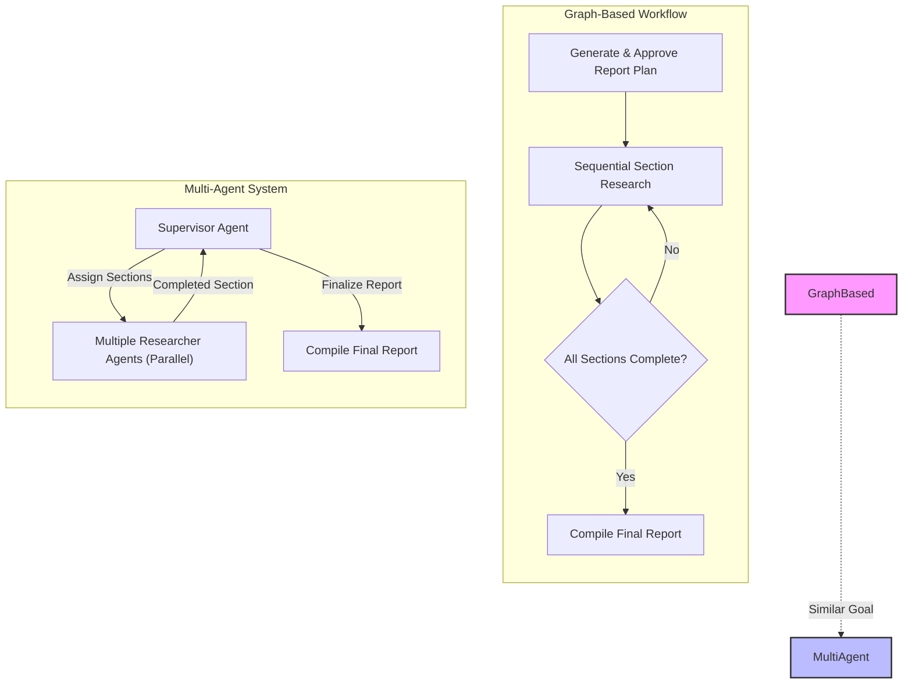

# Legacy Implementations: Alternative Research Architectures

Welcome to the Legacy Implementations guide for Open Deep Research. This page provides essential insights into the two primary legacy research architectures offered within the project: the workflow-based graph implementation and the multi-agent system.

These legacy approaches represent earlier design philosophies using distinct orchestration methods for automated deep research. Understanding these will help you experiment with alternative research flows, choose the right implementation for your needs, or customize your agent configuration.

---

## 1. Overview of Legacy Approaches

Open Deep Research includes two legacy implementations found in the `src/legacy/` directory:

### a. Workflow (Graph-Based) Implementation (`legacy/graph.py`)
- Uses a **structured plan-and-execute workflow** with explicit stages, such as generating a report plan, gathering user feedback, iterative research for sections, and final report assembly.
- Supports **human-in-the-loop feedback** to refine report outlines before full generation.
- Follows a **sequential process** to write each section with layered search, reflection, and quality grading.
- Emphasizes **report quality and accuracy**, enforcing structured outputs and multiple search iterations.
- Compatible with many **search APIs** including Tavily, Perplexity, ArXiv, PubMed, and more.

### b. Multi-Agent Implementation (`legacy/multi_agent.py`)
- Employs a **supervisor-researcher agent architecture**.
- The **Supervisor Agent** orchestrates report structure, performs clarification, and compiles the final report.
- Multiple **Researcher Agents** run concurrently, each tackling different report sections or queries.
- Designed for **speed and concurrency**, enabling faster report generation through parallelization.
- Integrated with **MCP (Model Context Protocol)**, leveraging local and remote MCP servers for data and tool access.
- Allows disabling web search tools to rely entirely on MCP-connected data sources, enabling flexible configurations.

---

## 2. When to Use Each Legacy Implementation

| Criteria                | Graph-Based Workflow                                | Multi-Agent Architecture                      |
|-------------------------|----------------------------------------------------|-----------------------------------------------|
| User Control            | High — human feedback and iterative planning       | Medium — automated coordination with less interaction |
| Research Speed          | Sequential and slower                              | Parallel and optimized for speed               |
| Customization Flexibility| Strong structural customization and feedback loops| Strong MCP integration and parallelism         |
| Use Cases               | Academic research, detailed reports, quality focus | Business intelligence, exploratory rapid research |
| Integration Support     | Wide variety of search APIs                         | MCP server integration with web search options |

---

## 3. Workflow Implementation Details

This implementation models the research process as a directed graph with distinct nodes:

- **Generate Report Plan**: Creates initial report sections and queries using a planner model.
- **Human Feedback Node**: Pauses flow to gather user input on the plan, allowing regeneration or approval.
- **Section Research**: Repeated cycles of query generation, web search, and section writing, graded for quality.
- **Final Sections and Compilation**: Sections not needing research (intro, conclusion) written in parallel; culminates in full report assembly.

### Key Features
- **Iterative Search Depth**: Limits the number of search-reflection cycles per section.
- **Query Generation**: Targeted and specific queries optimize search relevance.
- **Quality Grading**: Sections graded with pass/fail and follow-up queries generated if needed.
- **Structured Output**: Sections and final report follow precise markdown formatting with citations.

### Example Configuration Parameters
```python
report_structure = '''Use this structure to create a report ...'''  # Customizable report order
# Number of queries per section
number_of_queries = 2
# Maximum reflection cycles
max_search_depth = 2
# Search API
search_api = 'tavily'  # or 'perplexity', 'arxiv', etc.
```

The flow runs until plan approval and section research completion.

## 4. Multi-Agent Implementation Details

The multi-agent system breaks down tasks into roles:

- **Supervisor Agent**: Manages the workflow, asks clarifying questions if enabled, plans report structure, and assembles the final output.
- **Researcher Agents**: Parallel agents assigned sections to research independently, using configured tools (search APIs and MCP tools).

### MCP Integration
This implementation supports Model Context Protocol (MCP) servers for tool and data integration. MCP allows connecting diverse local and remote knowledge sources, including filesystems, databases, and APIs, via a standardized, JSON-RPC based client-server protocol.

### Configuration Highlights
- **Enabling Clarification**: `ask_for_clarification` controls supervisor's ability to seek user input.
- **Search API Support**: Tavily and DuckDuckGo are supported; can disable search entirely (`search_api: 'none'`) to rely solely on MCP tools.
- **MCP Server Config**: Pass configuration dict to include local or remote servers.
- **Concurrency Controls**: Number of concurrent researchers can be set.

### Example Setup
```python
config = {
  "supervisor_model": "anthropic:claude-3-5-sonnet-latest",
  "researcher_model": "anthropic:claude-3-5-sonnet-latest",
  "search_api": "tavily",
  "ask_for_clarification": True,
  "mcp_server_config": {...},
  "mcp_tools_to_include": ["read_file", "list_directory"]
}
```

The supervisor manages coordination and receives research results asynchronously.

---

## 5. Differences & Considerations

| Aspect                  | Workflow Graph Implementation                          | Multi-Agent Implementation                          |
|-------------------------|--------------------------------------------------------|----------------------------------------------------|
| Human Feedback          | Explicit, interactive pauses for plan feedback          | Optional, less interactive, mostly automated         |
| Execution Style         | Sequential: section research one at a time               | Parallel: multiple sections researched simultaneously |
| Search APIs             | Broad support, including academic sources                 | Limited, primarily Tavily and DuckDuckGo               |
| MCP Tooling             | Not currently supported                                  | Fully integrated with configurable MCP servers       |
| Report Assembly         | Plan-driven, strong sequential flow                      | Coordinator compiles parallel outputs                 |
| Use Case Fit            | High-fidelity reports, detailed refinement              | Rapid reports, distributed research                   |

---

## 6. Experimenting with Legacy Implementations

### Running the Graph-Based Workflow

1. Clone and set up the repo as usual.
2. Edit `.env` and other configs to select models, search APIs, and report structure.
3. Launch the graph workflow via `src/legacy/graph.py` or the corresponding notebook `src/legacy/graph.ipynb`.
4. Submit your research topic and interact with the approval step.
5. Approve or provide feedback to refine the report plan.
6. Let the agent generate sections sequentially.
7. Receive comprehensive markdown reports with citations.

### Running the Multi-Agent System

1. Configure your `.env` or config dict for the multi-agent as per `src/legacy/multi_agent.py` or `src/legacy/multi_agent.ipynb`.
2. Choose your supervisor and researcher models, search API, and MCP server settings.
3. Launch the multi-agent workflow, submitting your questions.
4. The system will run supervisor and multiple researcher agents concurrently.
5. Receive final reports faster due to parallel processing.

### Integration Tips

- Use the multi-agent approach when working with MCP servers to leverage external data sources beyond web search.
- The graph workflow is ideal when you want stepwise control and manual feedback.
- Customize prompts and models by editing the respective configuration classes.
- Monitor token usage and tune iteration parameters for efficiency.

---

## 7. Troubleshooting and Best Practices

- **Token Limit Errors**: Use smaller models or reduce max iterations to prevent token limit exceedance.
- **MCP Tool Naming Conflicts**: Ensure MCP tools have unique names to avoid being ignored.
- **Search API Support**: Verify search APIs are configured and supported in chosen implementation.
- **Feedback Loop**: In the workflow graph, always approve or provide meaningful feedback to proceed.
- **Concurrency**: Adjust `max_concurrent_research_units` in multi-agent for resource balancing.

---

## 8. Useful References & Resources

- [Detailed Graph Workflow Documentation](https://github.com/langchain-ai/open_deep_research/blob/main/src/legacy/graph.py)
- [Multi-Agent Implementation Details](https://github.com/langchain-ai/open_deep_research/blob/main/src/legacy/multi_agent.py)
- [MCP Servers and Integration](https://modelcontextprotocol.io/)
- [Open Deep Research README](https://github.com/langchain-ai/open_deep_research/blob/main/README.md)
- [Legacy Implementations Notebook (graph.ipynb)](https://github.com/langchain-ai/open_deep_research/blob/main/src/legacy/graph.ipynb)
- [Multi-Agent Example Notebook (multi_agent.ipynb)](https://github.com/langchain-ai/open_deep_research/blob/main/src/legacy/multi_agent.ipynb)

---

## 9. Next Steps

- Experiment with the legacy implementations to find the workflow approach best suited for your scenarios.
- Explore advanced configuration options for customizing models, tool integrations, search APIs, and concurrency.
- Transition gradually towards the current `deep_researcher.py` graph-based async workflow for state-of-the-art features.
- Consult related guides on MCP integration, evaluation methodologies, and the core Deep Researcher agent.


---

## Visual Comparison of the Two Legacy Architectures




---

For detailed usage, configuration, and troubleshooting, please refer to the individual scripts and notebooks in the `src/legacy/` directory.

---

*This guide is part of the Open Deep Research documentation suite. For comprehensive onboarding, explore [Deep Researcher: From Question to Report](https://docs.langchain.com/guides/core-workflows/researcher-quickstart) and [Integrating Search APIs and MCP Servers](https://docs.langchain.com/guides/integration-patterns/using-search-mcp-models).*