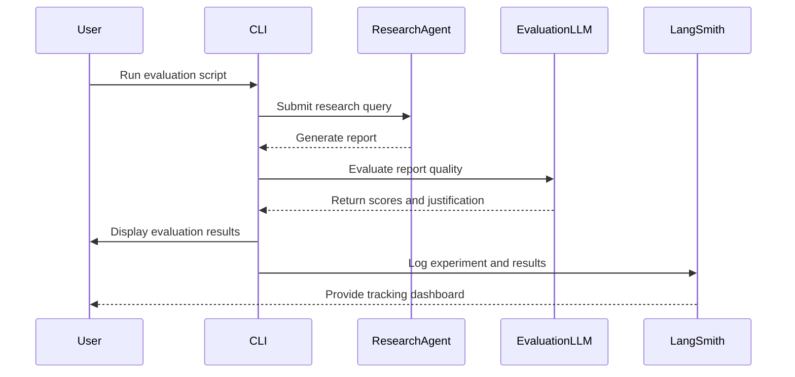

# Evaluating and Benchmarking Research Output

This guide walks you through the systematic process of evaluating research reports generated by Open Deep Research agents. Using the platform's built-in batch evaluators, datasets, and multi-dimensional scoring methods, you can objectively assess the quality of agent responses, interpret the results effectively, and track improvements over time.

---

## 1. Workflow Overview

### What You Will Achieve
- Understand how to run batch evaluations on research reports generated by either the graph-based workflow or the multi-agent implementations.
- Use automated evaluation frameworks to measure report quality against a set of strict, multi-dimensional criteria.
- Interpret the detailed evaluation outputs to identify strengths, weaknesses, and areas for refinement in your research agents.
- Track evaluation results centrally with LangSmith for benchmarking and historical reference.

### Prerequisites
- Open Deep Research set up locally or hosted with access to the LangGraph Studio UI or CLI.
- API keys configured for models and search APIs as needed.
- Familiarity with running Open Deep Research agents and submitting research topics.
- Basic knowledge of Python for running CLI-based evaluation scripts.

### Expected Outcome
By the end of this guide, you will confidently generate comprehensive evaluation reports that:
- Highlight report strengths across relevance, structure, and groundedness.
- Flag potential report flaws like irrelevant sections or missing citations.
- Provide detailed justifications and scoring breakdowns.
- Facilitate informed decisions on tuning model parameters or workflows.

### Time Estimate
Running an evaluation can take from a few minutes (small test sets) to tens of minutes depending on dataset size, model latency, and concurrency settings.

### Difficulty Level
Intermediate. Requires setup familiarity and ability to execute Python scripts.

---

## 2. Setting Up Evaluation

### Choosing an Evaluation Framework
Open Deep Research supports two primary evaluation approaches:

- **Pytest-Based Evaluation:**
  - Good for development and quick model comparisons.
  - Provides binary pass/fail results on 9 quality criteria.
  - Offers rich console output for troubleshooting and validation.

- **LangSmith Batch Evaluation:**
  - Designed for large dataset-driven scoring.
  - Provides granulated multi-dimensional scores (1-5 scale).
  - Records experiment metadata and allows historical analysis.

### Preparing Your Environment
1. Ensure your `.env` includes necessary environment variables for model API keys and search tools.
2. Install dependencies: `pip install open-deep-research langsmith`
3. Launch the LangGraph server if running local tests.

---

## 3. Running a Pytest Evaluation

### Purpose
Quickly verify if generated reports meet core quality criteria using automated tests.

### Step-by-Step

<Steps>
<Step title="Prepare Your Test Command">
Run the evaluation script with your chosen agent and configurations. For example:
```bash
python tests/test_report_quality.py --research-agent multi_agent --search-api tavily --eval-model anthropic:claude-3-7-sonnet-latest
```
This command runs a test for the multi-agent agent using the Tavily search API and the specified evaluation model.
</Step>

<Step title="Launch the Evaluation">
The script:
- Generates or retrieves a report based on a standard test query.
- Runs the evaluation LLM against the report using strict criteria, including section relevance.
- Outputs a rich console report with grading, justification, and formatting.
</Step>

<Step title="Review the Output">
- Confirm the pass/fail status.
- Inspect the table of report sections to ensure all are relevant.
- Examine the detailed justification panel to understand grading decisions.
- Use this feedback to tune your research pipeline if necessary.
</Step>
</Steps>

### Important Notes
- The evaluation is strict: any irrelevant section causes failure.
- You can customize input queries, criteria, and models through CLI options or environment variables.
- For detailed CLI options, see the `tests/conftest.py` in the codebase.

---

## 4. Running a LangSmith Batch Evaluation

### Purpose
Conduct multi-dimensional performance benchmarking across a dataset to track agent quality over time.

### Step-by-Step

<Steps>
<Step title="Edit Evaluation Script Parameters">
In `tests/run_evaluate.py`, customize parameters such as:
- `dataset_name` to select your evaluation dataset.
- Model and agent configuration (model names, search API).
- Max researcher iterations and concurrency settings.
</Step>

<Step title="Execute the Evaluation">
Run the script:
```bash
python tests/run_evaluate.py
```
This will batch process the dataset, invoking the deep researcher agent and running specialized evaluators.
</Step>

<Step title="Interpret Results">
- The system scores quality on four dimensions:
  1. Overall Quality
  2. Relevance
  3. Structure
  4. Groundedness
- Scores range 1–5, with weighted criteria as per evaluation design.
- Results are automatically logged to your LangSmith workspace for analysis.
</Step>

<Step title="Use Insights for Improvement">
- Compare model versions, parameter settings, or data configurations.
- Identify specific criteria where your agent underperforms.
- Adjust setup accordingly to target pain points.
</Step>
</Steps>

### Key Files
- `tests/evals/evaluators.py`: Implementations of evaluation dimensions
- `tests/evals/prompts.py`: Prompts used for scoring and grading
- `tests/evals/run_evaluate.py`: Orchestrator script for batch evaluation

---

## 5. Evaluation Criteria Explained

The evaluation systems assess reports on:

- **Topic Relevance**: Does the report thoroughly address the question and provide focused sections?
- **Section Relevance**: Each report section must be directly related and useful.
- **Structure and Flow**: Logical sequence and clear Markdown header usage.
- **Introduction and Conclusion**: Proper framing and meaningful summary.
- **Structural Elements**: Use of tables, lists, and citations to enhance clarity.
- **Citations**: Proper, relevant and complete source attribution.
- **Overall Quality**: Accuracy, depth, and writing professionalism.

---

## 6. Practical Tips & Best Practices

- **Use consistent model versions** to minimize noise in evaluation results.
- **Enable clarification** for improved report relevance during research agent configuration.
- **Adjust concurrency and iteration counts** based on available compute and latency constraints.
- Keep **sections concise yet informative** to maximize evaluator accuracy.
- Review **evaluation justification reports** thoroughly to identify subtle quality issues.

---

## 7. Troubleshooting Common Issues

<AccordionGroup title="Troubleshooting Evaluation Issues">
<Accordion title="Low Section Relevance Scores">
- Verify your research prompt precisely guides sections.
- Avoid overly generic or repetitive content prompts.
- Enable or tune clarification questions to refine scope.
</Accordion>

<Accordion title="Evaluation Fails Due to Formatting">
- Confirm proper Markdown heading levels (`#`, `##`, etc.) in reports.
- Check for missing or malformed citations.
- Use integrated Studio UI to preview report structure before evaluation.
</Accordion>

<Accordion title="Long Evaluation Times or Errors">
- Reduce dataset size for initial tests.
- Check model API rate limits and usage quotas.
- Ensure all dependencies and versions match documented requirements.
</Accordion>
</AccordionGroup>

---

## 8. Monitoring and Tracking Improvements

Integrate your evaluation runs with LangSmith:
- Track experiments and parameter changes.
- Visualize performance over historical runs.
- Share results with your team for collaborative tuning.

---

## 9. Next Steps & Related Documentation

- Explore deeper [Core Workflow Guides](../../core-workflows/researcher-quickstart) to optimize research agents.
- Learn about MCP server integration and its impact on research quality [here](../../integration-patterns/using-search-mcp-models).
- Review [Performance and Reliability Tips](../performance-and-reliability-tips) for production-grade deployments.
- For API and programmatic use, consult the [LangGraph Studio and Evaluate API documentation](../../integration-patterns/deployment-and-ui).

---

## Additional Resources

- [Open Deep Research GitHub Repository](https://github.com/langchain-ai/open_deep_research)
- [LangChain Chat Models and Structured Output](https://python.langchain.com/docs/how_to/chat_models_universal_init/)
- [LangSmith Official Documentation](https://docs.langsmith.com/)

---

## Illustrative Mermaid Diagram: Evaluation Workflow Overview



---

Congratulations! You are now equipped to effectively evaluate research reports, benchmark your Open Deep Research agents, and iteratively improve research quality with confidence.


# Example Pytest Evaluation Command
```bash
python tests/test_report_quality.py --research-agent multi_agent --search-api tavily --eval-model openai:o3
```

# Example LangSmith Batch Evaluation Execution
```bash
python tests/run_evaluate.py
```

---

For complete configuration options, troubleshooting, and usage examples, see the related guide [Evaluating and Benchmarking Research Output](https://github.com/langchain-ai/open_deep_research/blob/main/src/legacy/legacy.md).