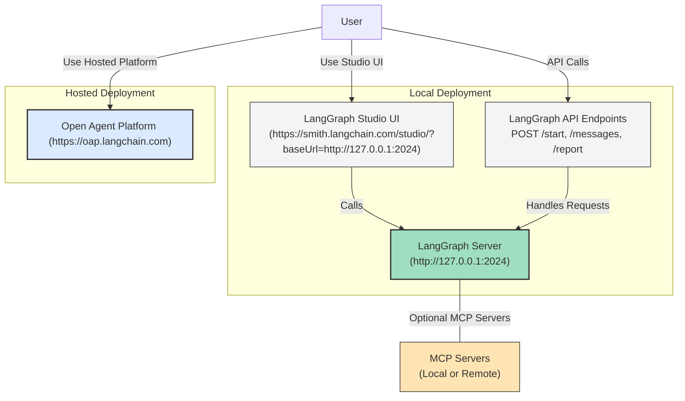

# Studio, API, and Platform Deployments

Deploy and operate Open Deep Research seamlessly using LangGraph Studio, API endpoints, or the hosted Open Agent Platform (OAP). This guide helps you set up local and cloud-backed solutions, launch the Studio UI for interactive research, and connect with the wider LangGraph and OAP ecosystems.

---

## 1. Workflow Overview

### What This Guide Covers
This page focuses exclusively on deploying and operating Open Deep Research using three primary interfaces:

- **LangGraph Studio**: The development and interaction UI for visualizing workflows, submitting queries, and viewing report outputs.
- **API Endpoints**: Programmatic access to the research agent via LangGraph API.
- **Open Agent Platform (OAP)**: A hosted platform for non-technical users to build and configure custom agents, including Deep Researcher.

You will learn how to start local servers, access the Studio UI, leverage API endpoints, and get started with OAP deployments.

### Prerequisites
- You have cloned the Open Deep Research repository and installed all dependencies per the [Installation Guide](https://github.com/langchain-ai/open_deep_research/blob/main/README.md#quickstart).
- Environment variables and API keys are configured properly via your `.env` file.
- Basic familiarity with running Python applications and opening URLs in a browser.

### Expected Outcome
By following this guide, you will:
- Successfully start Open Deep Research on your local machine.
- Open and use LangGraph Studio for research workflows.
- Understand API endpoints for integration.
- Get started with the Open Agent Platform to use or deploy Deep Researcher.

### Time Estimate
~15 to 30 minutes depending on your environment setup.

### Difficulty Level
Beginner to Intermediate (assuming basic terminal and environment config skills).

---

## 2. Step-by-Step Deployment Instructions

### A. Deploying Locally with LangGraph Studio

The LangGraph Studio offers a graphical interface to experiment with Open Deep Research quickly.

#### Step 1: Start the LangGraph server locally

Open your terminal in the repository root and execute the following depending on your OS:

##### MacOS
```bash
# Install uv package manager if not already installed
curl -LsSf https://astral.sh/uv/install.sh | sh

# Install dependencies and start LangGraph server
uvx --refresh --from "langgraph-cli[inmem]" --with-editable . --python 3.11 langgraph dev --allow-blocking
```

##### Windows / Linux
```powershell
# Install dependencies
pip install -e .
pip install -U "langgraph-cli[inmem]"

# Start LangGraph server
langgraph dev
```

You should see logs indicating the server has started and is listening on `http://127.0.0.1:2024`.

#### Step 2: Open LangGraph Studio UI

In your browser, navigate to:

```
https://smith.langchain.com/studio/?baseUrl=http://127.0.0.1:2024
```

This loads the Studio interface connected to your local API.

#### Step 3: Access API Documentation

For detailed API usage, point your browser to:

```
http://127.0.0.1:2024/docs
```

Here you can explore endpoints, send test requests, and understand payload formats.

#### Step 4: Using Studio UI

- Submit research queries by entering your topic or research question into the input box.
- Observe the asynchronous generation of research plans, report sections, and the final synthesized report.
- Provide feedback on plans when prompted, approve report structures, and iterate as needed.

<br>

### B. Deploying with Hosted Open Agent Platform (OAP)

The Open Agent Platform offers a hosted, non-technical UI to configure and run Deep Researcher with minimal setup.

#### Step 1: Visit the public OAP demo

Try the Deep Researcher agent without any local installation via our public instance:

[https://oap.langchain.com](https://oap.langchain.com)

Add your API keys for models and search services as required.

#### Step 2: Deploy your own OAP instance (optional)

For custom control or integrating into your organization:

1. Follow the official OAP deployment guide: [Deploy Open Agent Platform](https://docs.oap.langchain.com/quickstart)
2. Add Open Deep Research as an agent: [Add Deep Researcher to OAP](https://docs.oap.langchain.com/setup/agents)
3. Configure MCP servers and search APIs via the OAP interface to tailor research behavior.

### C. Using API Endpoints Directly

Open Deep Research exposes REST APIs via LangGraph for integration into your own applications.

#### Example API Endpoints:
- `POST /start` — initiate a new research session
- `POST /messages` — send research query or feedback
- `GET /report` — retrieve completed research report

You can browse full API specs at `/docs` when running a local LangGraph server.

#### Practical Tips:
- Use API clients like `curl` or Postman to explore endpoints.
- Maintain session `thread_id`s for continuous conversation context.

---

## 3. Practical Examples

### Using the Studio UI

1. Start the server as described above.
2. Open the Studio UI URL.
3. Enter a topic such as "Climate change impact on agriculture".
4. Click Submit.
5. Review the generated report plan.
6. Provide feedback or approve.
7. Watch report sections generate asynchronously.
8. View and export the final Markdown report.

### Calling API via `curl`

```bash
# Start a new session
curl -X POST http://127.0.0.1:2024/start -d '{"messages": [{"role": "user", "content": "What are the effects of quantum computing?"}]}'

# Continue the session with thread_id
curl -X POST http://127.0.0.1:2024/messages -d '{"thread_id": "your-thread-id", "messages": [{"role": "user", "content": "Please expand on applications in cryptography."}]}'

# Get report
curl http://127.0.0.1:2024/report?thread_id=your-thread-id
```

### Connecting MCP Servers in OAP

Configure MCP server endpoints and prompts via OAP settings to enable access to local files, databases, or APIs during research.

Example query to filesystem MCP server:

```json
{
  "mcp_server_config": {
    "filesystem": {
      "command": "npx",
      "args": ["-y", "@modelcontextprotocol/server-filesystem", "/path/to/your/root"]
    },
    "mcp_tools_to_include": ["list_allowed_directories", "list_directory", "read_file"]
  },
  "mcp_prompt": "Follow the sequence: list_allowed_directories, then list_directory, then read_file."
}
```

---

## 4. Troubleshooting & Tips

### Common Issues

- **Server fails to start:** Verify Python 3.11 is installed, dependencies are properly installed, and `.env` contains valid API keys.
- **Studio UI won't load:** Confirm the LangGraph server is running on `127.0.0.1:2024`, check firewall settings.
- **API calls fail:** Ensure thread IDs are correctly maintained, use `/docs` to verify request structure.
- **Token limit errors:** Reduce max tokens for models in `.env`, or limit report complexity.
- **Too few concurrent research units:** Increase `max_concurrent_research_units` in config to speed parallelism.

### Best Practices

- Use the feedback loop in Studio to refine research plans before report generation.
- Leverage multi-agent implementation when speed is critical; use Studio UI primarily with graph-based for control.
- For local knowledge and secure data access, configure MCP servers carefully with explicit allowed directories.
- Always review API keys and permissions, especially for integrated search services and MCP.

---

## 5. Next Steps & Related Content

- **Configuration Setup:** Customize models, search options, and MCP integration. See [Configuration Setup](../setup-basics/configuration-setup).
- **Deep Researcher Quickstart:** Learn the full research workflow from question input to report output. See [Deep Researcher Quickstart](/guides/core-workflows/researcher-quickstart).
- **Integrating Search APIs and MCP Servers:** Advanced customization with external tools. See [Integration Patterns](../integration-patterns/using-search-mcp-models).
- **Evaluations & Benchmarks:** Validate and improve research output quality. See [Running Evaluations](/guides/evaluation-and-best-practices/running-evaluations).

---

## Visual Overview of Deployment Flow



---

# Additional Resources

- [Open Deep Research GitHub Repository](https://github.com/langchain-ai/open_deep_research)
- [LangGraph Studio Documentation](https://langchain-ai.github.io/langgraph/tutorials/studio/)
- [Open Agent Platform Documentation](https://docs.oap.langchain.com/quickstart)
- [MCP Protocol Specification & SDKs](https://modelcontextprotocol.io/introduction)

---

## Summary
This page guides you through deploying Open Deep Research using the LangGraph Studio UI locally, consuming the API endpoints programmatically, and leveraging the Hosted Open Agent Platform. You will gain hands-on access to all interfaces to run deep research workflows, customize configurations, and connect MCP servers for enriched context and integrations.

For detailed setup and usage, combine this deployment guide with configuration, model tuning, and research workflow documentation from related sections.

---

<Tip>
For a smooth experience, always verify that your `.env` file includes valid API keys and that the LangGraph server logs show successful startup before interacting with the Studio UI or API.
</Tip>

<Note>
Deploying to the Open Agent Platform is highly recommended for non-technical users or teams seeking a ready-to-go research environment with user-friendly configuration.
</Note>

<Warning>
When integrating MCP servers, ensure you understand their security implications and limit tool permissions to prevent unauthorized data access.
</Warning>
