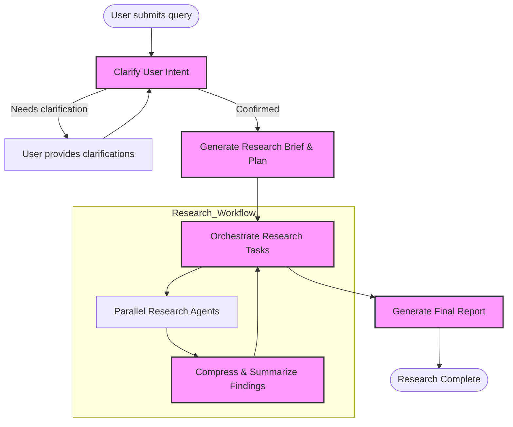

# How the Research Process Works

Explore how Open Deep Research guides you from an initial query to a comprehensive, well-structured report through an intelligent, agent-driven workflow. This documentation walks you through a typical research journey highlighting the agentic approach, asynchronous orchestration across multiple research phases, and the flexible, role-based model configurations that power deep investigation.

---

## Introduction: From Question to Deep Insights

Research starts with a user's query—often broad or ambiguous. Open Deep Research uses this input to clarify intent, plan an investigative strategy, conduct focused data retrieval and analysis, and finally synthesize the insights into a polished report.

The process embodies an agentic mindset:

- **User Intent Clarification**: The system interacts with you to ensure understanding of the research scope and depth.
- **Multi-Step Investigation**: Research is broken into manageable chunks, using multiple specialized agents or workflow nodes.
- **Asynchronous Orchestration**: Tasks like conducting multiple queries, calling external tools, and compressing findings happen concurrently where possible, maximizing efficiency.
- **Configurable Model Roles**: Different phases leverage models tailored for planning, researching, compressing information, and final report writing.

This optimized orchestration harmonizes human-like inquiry with cutting-edge automation.

---

## Step 1: Clarify the Research Query

Before diving into data collection, Open Deep Research may request clarifications to refine the research focus. This step prevents wasted effort on irrelevant or poorly scoped searches.

- The system analyzes your initial query.
- If ambiguity is detected, it formulates specific clarifying questions.
- You respond with your preferences or constraints.
- Once instructed, the system confirms readiness and proceeds.

This proactive step ensures the outcome matches your expectations precisely.

### Example

If you asked: "Tell me about MCP," the system might reply:

> "Do you want a high-level overview or a technical developer guide? Any preferred focus areas like security, architecture, or use cases?"

Your response guides the subsequent research plan.

---

## Step 2: Generate a Research Brief and Planning

With a clarified query, the assistant creates a detailed research brief that structures the investigation:

- Converts informal questions into explicit topics.
- Sets the scope, depth, and subtopics for research.
- Initializes supervisor-level agents or workflow nodes to orchestrate research tasks.

This stage acts as the research blueprint, aligning all downstream exploration.

---

## Step 3: Orchestrate Multi-Agent or Workflow-Based Research

Two distinct research architectures execute the core investigative work. Both emphasize modularity, asynchronous processing, and iterative reflection.

### Architecture Options

| Architecture Type | Characteristics | When to Use |
|-------------------|-----------------|-------------|
| **Graph Workflow** | Sequential, plan-and-execute process with human-in-the-loop feedback at key stages. Research proceeds section-by-section with iterative reflections and approvals. | Ideal for high-stakes, accuracy-critical, and customized reports where human oversight is valuable. |
| **Multi-Agent Implementation** | Parallel research with a supervisor coordinating multiple independent researcher agents. Concurrent section investigation and synthesis accelerate report completion. | Optimal for rapid report generation, exploratory research, and contexts valuing efficiency over granular control. |

### Workflow Details

- **Supervisor Agent / Node**: Develops the high-level report structure, delegates research tasks, aggregates findings.
- **Researcher Agents / Nodes**: Tasked with researching specific subtopics using search APIs and MCP tools.
- **Tool Calling and External Data Access**: Agents invoke configured search APIs or MCP servers to retrieve relevant information.
- **Iterative Reflection**: Supervisors reflect on aggregated research, request further clarification or re-research if needed.

---

## Step 4: Tool-Augmented Research

Agents use a variety of external resources to retrieve and expand their knowledge base:

- **Web Search APIs**: Tavily, Perplexity, DuckDuckGo, Exa, ArXiv, PubMed, and more provide broad coverage.
- **MCP Servers**: Extend research capabilities allowing agents to query local file systems, databases, APIs, or other enterprise data sources securely and efficiently.
- **Asynchronous Execution**: The system runs multiple research tasks in parallel, bounded by configuration limits to balance speed with resource and rate-limit considerations.

All data is collected with provenance to support later citation and source verification.

---

## Step 5: Compress and Synthesize Findings

Large volumes of research output must be distilled into actionable insights:

- Research notes from parallel agents are compressed using specialized summarization models.
- Compression models reduce verbosity while preserving factual accuracy and context.
- Compressed research is fed back to supervisors or report writers for integration.

This step ensures the final report is concise, coherent, and free from redundancy.

---

## Step 6: Generate the Final Report

The assistant composes a unified, polished report:

- Uses dedicated final report models trained or configured to write well-structured markdown reports.
- Incorporates the research brief, consolidated notes, and synthesized findings.
- Adds introductions, conclusions, and structural elements like tables or lists for clarity.
- Ensures all sections include cited sources to support transparency and trustworthiness.

### Outcome

You receive a comprehensive, professional-grade research report ready for review or publication.

---

## Under the Hood: Configurable Model Roles

Open Deep Research intelligently assigns roles to models for optimal specialization:

- **Clarification Model**: Engages users when initial queries require refinement.
- **Research Model**: Drives inquiry, analyzes data, calls external tools.
- **Compression Model**: Synthesizes extensive data into digestible summaries.
- **Final Report Model**: Crafts the end-to-end report with proper structure and polish.

This role-based approach improves efficiency and output quality by leveraging distinct model capabilities.

---

## Practical Tips & Best Practices

- **Fine-Tune Concurrency Settings**: Adjust the number of concurrent research units to optimize for speed vs. rate limits.
- **Leverage MCP for Richer Context**: Use MCP tools to incorporate proprietary or local data alongside public web data.
- **Use Clarifications Strategically**: Enable user query clarification for complex topics to avoid misaligned research.
- **Monitor Token Limits**: Configure models and prompts mindful of token budgets to prevent truncation or failures.

---

## Common Pitfalls & Troubleshooting

- **No Tools Found**: Ensure search APIs or MCP tools are properly configured; agents require at least one tool for research.
- **Exceeding Token Limits**: If models fail due to token limits, trim prompts or adjust model max token settings.
- **Overflowing Research Units**: Surpassing max concurrent units leads to skipped research calls; balance concurrency for your environment.
- **Structured Output Failures**: Use models that support structured outputs and tool calling to avoid parsing errors.

Refer to the evaluation guides to validate report quality and system behavior.

---

## Visualizing the Workflow

---

## Summary

The research workflow embodies an iterative, agentic system combining user intent clarification, multi-step asynchronous research with both web and MCP data sources, and specialized model roles to deliver high-quality, comprehensive reports.

By stepping through clarification, detailed planning, parallel investigation, compression of findings, and robust final report synthesis, Open Deep Research enables users to transform complex queries into actionable knowledge rapidly and reliably.

---

## Additional Resources

- [Open Deep Research Overview & Getting Started](/overview/getting-started-intro/what-is-open-deep-research)
- [Core Concepts & Terminology](/overview/getting-started-intro/core-concepts-and-terminology)
- [Legacy Implementations & Architectures](src/legacy/legacy.md)
- [Integration Patterns: MCP Servers & Tools](/concepts/security-and-integrations/integration-patterns)
- [Evaluation & Benchmarking Research Output](/guides/evaluation-and-best-practices/running-evaluations)

---

For deeper insight into how specific implementations differ or to explore hands-on notebooks demonstrating research workflows, consult the [Legacy Implementation documentation](src/legacy/legacy.md) and example notebooks: 
- `src/legacy/graph.ipynb` for the graph workflow
- `src/legacy/multi_agent.ipynb` for the multi-agent system

---

## Next Steps

- Provide your research query through the UI or API.
- Enable clarification stages if desired.
- Configure your preferred search APIs and MCP tools.
- Monitor the asynchronous progress through LangGraph Studio or your deployment.
- Review and iterate on generated report plans and outputs.

This page builds foundational understanding of the full research process and prepares you to configure and customize Open Deep Research workflows effectively.

---