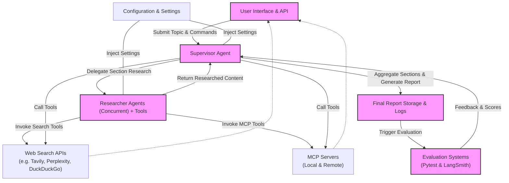

# System Architecture Overview

## Visualizing the Core Architecture

Open Deep Research is an advanced AI-powered research assistant designed to automate deep, comprehensive research workflows. This page presents a high-level architectural diagram and explanation, illustrating how the main components collaborate to deliver accurate, timely, and richly sourced research reports.

The architecture integrates multiple specialized agents, rich tool ecosystems including web search and Model Context Protocol (MCP) servers, and robust evaluation systems, all coordinated with clear data and control flows.

---

### Architecture Diagram

---

## Component Descriptions

### User Interface & API
- The gateway through which users submit their research queries and interact with the system.
- Provides both a friendly Studio UI and API access endpoints.

### Supervisor Agent
- The central orchestrator that manages the overall research process.
- Plans report structure, assigns sub-tasks to researcher agents, and assembles the final report.
- Capable of calling web search APIs, MCP tools, or requesting clarifications.

### Researcher Agents
- A pool of specialized agents working concurrently on assigned report sections.
- They independently conduct deep research by invoking search APIs and MCP tools.
- Responsible for collecting, synthesizing, and compressing research content.

### Web Search APIs
- External search services integrated for real-time web data retrieval.
- Includes providers like Tavily, Perplexity, DuckDuckGo, ArXiv, PubMed, and more.
- Selected according to configuration, allowing tailored or combined searches.

### MCP Servers
- Lightweight client-server protocol servers that expose specialized capabilities.
- Enable direct, standardized access to external data sources such as filesystems, databases, APIs, and SaaS platforms.
- Extend the agent’s research scope beyond general web search to internal or private resources.

### Evaluation Systems
- Includes both a Pytest-based and LangSmith Evaluate API system.
- Continuously assess the quality, relevance, and accuracy of generated reports.
- Provide actionable feedback and quality scores to improve research iterations.

### Final Report Storage & Logs
- Collects all researched sections, introduction, and conclusion into a unified markdown report.
- Stores provenance data, source strings, and operational logs for auditing and analysis.

### Configuration & Settings
- Central repository for configuring models, API keys, concurrent limits, and prompts.
- Ensures consistent parameters are injected into agents and tools.
- Enables flexible deployment options and customization for different use cases.

---

## Data and Control Flow

1. **User Initiates Research:** The user submits a research topic and optional parameters via the UI or API.

2. **Planning & Delegation:** The Supervisor Agent interprets the topic, generates a report plan, and divides work into sections.

3. **Concurrent Research:** Researcher Agents independently research assigned sections, invoking both web search APIs and MCP servers for rich content retrieval.

4. **Content Synthesis & Compression:** Research agents compress and summarize findings into concise sections.

5. **Aggregation:** The Supervisor Agent collects the completed sections, integrates introduction and conclusion, and compiles the final report.

6. **Evaluation:** The Evaluation Suite automatically analyzes the report’s quality and coherence, providing feedback for potential improvements.

7. **Report Delivery:** The comprehensive research report is stored and returned to the user.

8. **Iterative Improvements:** Based on evaluation and user feedback, the process can loop for refinement.

---

## Practical Scenarios

- **Interactive Research Control:** Use the Supervisor Agent’s human-in-the-loop planning to review and modify report structure.
- **Fast Parallel Report Generation:** Leverage multiple Researcher Agents to speed up data collection across diverse information sources.
- **Extending Research Scope:** Incorporate MCP Servers to fetch internal enterprise data, local files, or specialized APIs securely.
- **Reliable QA and Evaluation:** Automatically validate report relevance, structure, and citations through built-in evaluation frameworks.

---

## Tips and Best Practices

- Configure your MCP Servers carefully with appropriate access restrictions to maintain data security.
- Select the search APIs based on your domain needs; combine multiple APIs if necessary.
- Monitor evaluation feedback to continuously improve research strategies.
- Use concurrency settings prudently to balance speed and resource consumption.
- Keep API keys and models updated in the configuration to maximize effectiveness.

---

## Troubleshooting Common Issues

- **No Tools Available for Research:** Ensure search APIs or MCP tools are properly configured; otherwise, the Researcher Agents cannot perform searches.
- **Token Limit Errors:** Models may hit token limits during synthesis; configure model max_tokens or adjust input message sizes.
- **Incomplete Reports:** Validate that Supervisor Agent proceeds through all workflow states; check message flows and logs.
- **MCP Server Connection Failures:** Verify server config, network accessibility, and authentication setup.

---

## Getting Started with the Architecture

- Begin by cloning the repository and configuring environment variables for your preferred models and search providers.
- Launch the LangGraph server to access the Studio UI for testing research queries.
- Explore the multi-agent and graph workflow implementations documented elsewhere for hands-on experiments.
- Review evaluation results to validate report quality.

For detailed usage and code examples, refer to the [Graph-based Workflow Overview](overview/architecture-and-features/how-research-flows) and [Multi-agent Implementation](guides/core-workflows/researcher-quickstart) documentation.

---

## Additional Resources

- [Open Deep Research Official Repository](https://github.com/langchain-ai/open_deep_research)
- [Model Context Protocol Documentation](https://modelcontextprotocol.io)
- [LangGraph Studio UI](https://smith.langchain.com/studio/)
- [Evaluation Systems Guide](guides/evaluation-and-best-practices/running-evaluations)

---

By understanding this system architecture, users and integrators gain a clear picture of how Open Deep Research assembles its powerful, flexible research capabilities, enabling confident customization and deployment.
