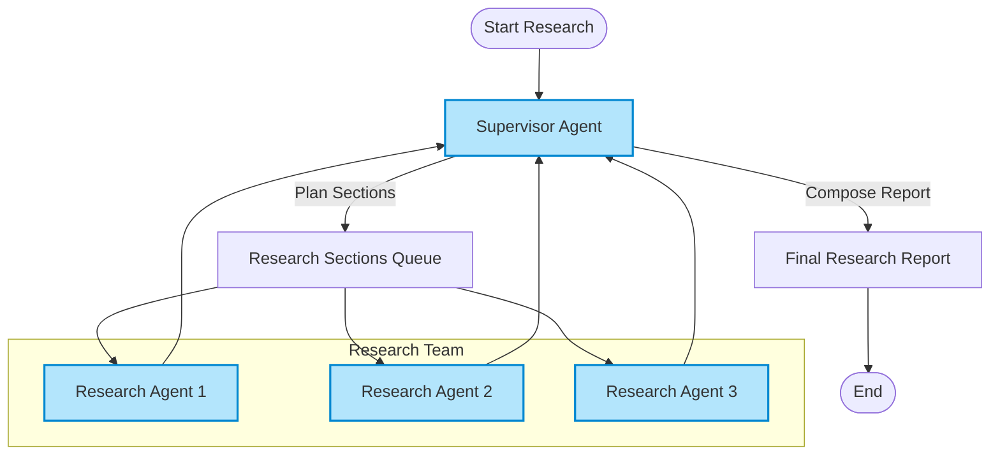

# What is Open Deep Research?

## Unlocking the Power of Automated Deep Research

Open Deep Research is a fully open-source, configurable AI agent system designed to automate deep, multi-faceted research and generate comprehensive analytical reports. It orchestrates large language models with advanced search tools to produce structured, well-sourced insights at scale — transforming how researchers, analysts, and professionals access, synthesize, and communicate complex knowledge.

### Why Open Deep Research Matters

Today's knowledge workers face overwhelming volumes of data across multiple formats and sources. Manually sifting through this information to create detailed reports is inefficient and error-prone. Open Deep Research streamlines this entire process, reducing time and effort while improving accuracy and depth.

### What You Achieve Here

- Automated report generation on virtually any topic
- Integration with multiple search APIs and knowledge bases
- Flexible configurations to match your preferred models and workflows
- A choice of two research implementations tailored for different goals
- Ability to augment research with local and external data via MCP (Model Context Protocol) plugins

---

## What is Open Deep Research?

Open Deep Research is an AI-powered system that deeply researches a user’s query by coordinating specialized language models and search tools to produce thorough, markdown-formatted research reports. It’s designed to be adaptable, letting users configure everything from the models to be used, the search APIs engaged, and how the final report is structured.

At its core, it solves a fundamental problem: making complex, multi-source research accessible, timely, and reliable by automating the entire discovery and synthesis pipeline.

### Core Purpose

Open Deep Research enables users to:

- Input a high-level topic or question
- Automatically plan a research report structure (sections and scope)
- Execute detailed research on each section using multiple search engines and data sources
- Aggregate results into a coherent, reader-friendly report with introduction, body, and conclusion

### Unique Approach and Differentiators

- **Configurable Architecture:** Supports a broad range of language models and search APIs out of the box, including OpenAI, Anthropic, Groq, Tavily, DuckDuckGo, and more.
- **Flexible Implementations:** Offers both a graph-based sequential workflow with human-in-the-loop planning and a multi-agent implementation that parallelizes section research for faster output.
- **MCP Integration:** Extends research beyond web search by tapping local filesystems, databases, and custom APIs securely through Model Context Protocol (MCP) servers.
- **Comprehensive Reporting:** Produces markdown reports with proper citations, structural elements, and supports custom report templates.

---

## Key Features & Capabilities

### 1. Two Distinct Research Architectures

| Architecture | Description | Benefits | Use Case |
|--------------|-------------|----------|----------|
| **Graph-based Workflow** | A step-by-step plan-and-execute system allowing review and human feedback on the report outline before content generation. | Fine-grained control, high report accuracy, iterative refinement, user-driven plan customization. | Academic, professional, or high-stakes research where accuracy is critical. |
| **Multi-Agent System** | A supervisor-agent overseeing multiple parallel researcher agents that concurrently produce report sections. | Faster report generation via parallelization, minimal human intervention, scalable for large projects. | Business intelligence, market research, exploratory projects requiring speed. |

### 2. Advanced Search Tool Integration

- Supports popular web search APIs like Tavily, DuckDuckGo, Perplexity, Exa, ArXiv, PubMed, Linkup, Google Search, Azure AI Search.
- Easily extendable to custom or emerging search providers.
- Configurable search depth, query count, and domain filters to tailor the research scope.

### 3. Model Flexibility and Structured Outputs

- Compatible with all models accessible via the universal `init_chat_model()` API, including OpenAI, Anthropic, Groq, and open-source alternatives.
- Ensures structured output compatibility, crucial for generating coherent and well-formatted research sections.

### 4. Model Context Protocol (MCP) Support

- Enables research agents to incorporate external knowledge beyond web search by connecting to local files, databases, APIs, and other data sources.
- MCP servers expose functionality through a standardized JSON-RPC protocol.
- Examples include filesystem servers, PostgreSQL access, Slack message summarization, and more.

### 5. Evaluation Frameworks

- Built-in Pytest-based evaluation system for quick testing and quality feedback.
- Batch evaluation capabilities with LangSmith API for detailed report analysis and benchmarking across multiple metrics such as topic relevance, structure, citations, and writing quality.

---

## Why Should I Care?

### Deliverables You Can Expect

- Fast, automated generation of detailed research reports on any topic with minimal manual effort.
- Highly customizable configurations to match your preferred models, research depth, and data sources.
- Flexibility to switch between detailed interactive workflows and speedy multi-agent parallel research.
- Integration with multiple search engines and local/external data sources for broader context and accuracy.
- Quality-assured output with built-in, extensible evaluation systems.

### Common Use Cases

- **Academics and Students:** Automate deep dives into scholarly articles, datasets, and scientific papers.
- **Business Analysts:** Quickly synthesize market intelligence, competitor analysis, or industry trends.
- **Developers and Data Scientists:** Generate comprehensive technical reports with real-time access to local data sources.
- **Researchers and Writers:** Rapidly create well-structured whitepapers, briefs, and reports.

### Before & After

| Without Open Deep Research | With Open Deep Research |
|---------------------------|-------------------------|
| Manually collect, filter, and synthesize information across many sources. | Automate the discovery, synthesis, and report generation with AI and search integration.
| Time-consuming, error-prone, inconsistent report quality. | Faster, repeatable, reliable, well-cited, and markdown formatted reports.
| Disconnected workflow with lots of manual hand-offs. | Seamless, end-to-end configurable pipeline with human-in-the-loop or agent-driven workflows.

### Quantifiable Benefits

- Reduction in time spent researching and compiling reports by orders of magnitude.
- Flexible concurrency settings allow balancing speed with model/API quotas.
- Seamless integration of external data sources ensures relevant, up-to-date context.

---

## Getting Started Preview

### Quick Start Overview

1. Clone the GitHub repository and install dependencies.
2. Configure `.env` and environment variables for your models and search APIs.
3. Launch the LangGraph server and access the Studio UI.
4. Input your research topic and choose your preferred implementation (graph workflow or multi-agent).
5. Review and optionally provide feedback on the planned report (available in the graph-based workflow).
6. Generate the full research report automatically, complete with introduction, body sections, and conclusions.

### Prerequisites

- API keys for your preferred LLM providers (OpenAI, Anthropic, etc.).
- Search API keys if you want to use web search capabilities.
- Python 3.11+ environment with dependencies installed.

### Next Steps

- Explore the [Core Concepts & Terminology](https://docs.langchain.com/overview/getting-started-intro/core-concepts-and-terminology) page to understand fundamental ideas behind Open Deep Research.
- Review the [System Architecture Overview](https://docs.langchain.com/overview/architecture-and-features/system-architecture) for an architectural insight.
- Try out hands-on guides like [Your First Research Query](https://docs.langchain.com/getting-started/first-run-usage/your-first-research-query) to see the agent in action.
- Learn about integrating MCP servers for extended data access in the [Integration & Deployment Options](https://docs.langchain.com/overview/architecture-and-features/integration-and-deployment) page.

---

## Diagram: High-Level Multi-Agent Workflow Overview

This diagram illustrates the parallel processing of sections by researcher agents under the coordination of a supervisor agent who compiles the final report.

---

## Additional Tips & Best Practices

- **Choose Your Implementation Based on Needs:** For control and iterative feedback, prefer the graph-based workflow. For speed and scale, select the multi-agent approach.
- **Configure Search API Thoughtfully:** Use domain filters and result limits to keep research focused and reduce noise.
- **Leverage MCP To Access Internal Data:** If your research requires proprietary or internal data, MCP integration is essential.
- **Monitor Model Usage and Token Limits:** Watch for token limit errors and adjust model parameters or query scope accordingly.
- **Use Evaluation Systems To Ensure Quality:** Regularly run evaluations to gauge report quality and adjust settings.

---

## Troubleshooting

- **No Tools Found for Research:** Ensure that your configuration specifies at least one search API or MCP tool.
- **Token Limit Exceeded Errors:** Lower max token settings or reduce concurrent research units.
- **Report Sections Not Generating:** Check that your topic is well-formed and the planning phase completes successfully.
- **MCP Tools Not Available:** Confirm your MCP server configurations and tool inclusions are correct.

For more, refer to the [Performance, Reliability, and Troubleshooting](https://docs.langchain.com/guides/evaluation-and-best-practices/performance-and-reliability-tips) section.

---

## Summary

Open Deep Research empowers users to automate multi-source deep research by orchestrating state-of-the-art language models and diverse search engines within a flexible, open-source framework. Whether you prioritize accuracy or speed, or want to access local data securely via MCP, this system adapts to your workflow needs, elevating research quality and efficiency.

---

_For comprehensive configuration guidance, examples, and detailed architectural explanations, please explore the rest of the Open Deep Research documentation or visit the GitHub repository._

---

## References & Further Reading

- [Open Deep Research GitHub Repository](https://github.com/langchain-ai/open_deep_research)
- [Model Context Protocol (MCP) Official Site](https://modelcontextprotocol.io)
- [LangChain init_chat_model API](https://python.langchain.com/docs/how_to/chat_models_universal_init/)
- [Open Deep Research Legacy Implementations](https://github.com/langchain-ai/open_deep_research/tree/main/src/legacy)
- [Open Deep Research Evaluation Systems](https://github.com/langchain-ai/open_deep_research/tree/main/tests)

---